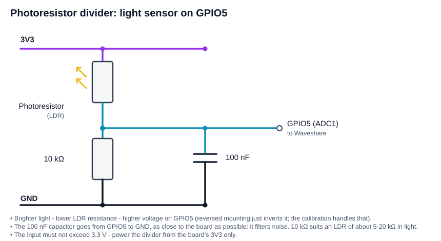
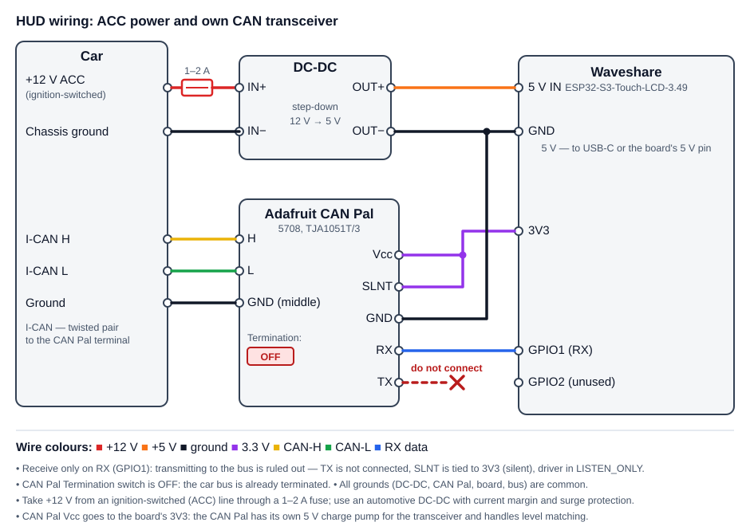
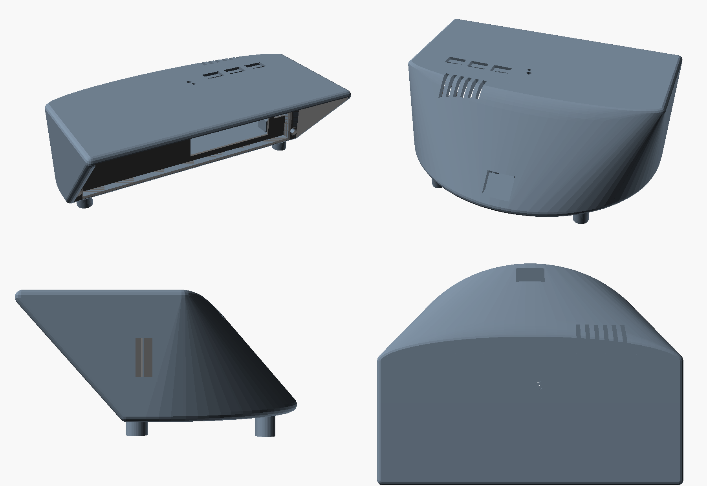

# HUD for Audi A4 B9 (MLB-Evo) on Waveshare ESP32-S3-Touch-LCD-3.49

A DIY head-up display showing live vehicle data: speed, gear, cruise control and
speed limiter, Lane Assist, traffic signs, turn signals, doors and navigation arrows.
Data is read passively from the I-CAN (infotainment) bus; nothing is ever transmitted.

[Русская версия](README_ru.md)

> **Data source** — the sniffer / BLE gateway: [esp32-CAN-sniffer-logger-screener](https://github.com/WARMW00D/esp32-CAN-sniffer-logger-screener).
> The same repository describes a simplified CAN→BLE gateway for the HUD (no SD card, powered from ACC).

---

## Contents

1. [What the HUD shows](#what-the-hud-shows)
2. [Architecture](#architecture)
3. [Hardware](#hardware)
4. [Building the firmware](#building-the-firmware)
5. [Settings in `hud_config.h`](#settings-in-hud_configh)
6. [Screen layout](#screen-layout)
7. [Data sources (CAN)](#data-sources-can)
8. [Sniffer → HUD BLE protocol](#sniffer--hud-ble-protocol)
9. [Graphics: fonts and images](#graphics-fonts-and-images)
10. [Bench testing and diagnostics](#bench-testing-and-diagnostics)
11. [Troubleshooting](#troubleshooting)
12. [File structure](#file-structure)
13. [Unverified items and roadmap](#unverified-items-and-roadmap)
14. [Safety and legal notes](#safety-and-legal-notes)
15. [Credits](#credits)

---

## What the HUD shows

| Element | Behaviour |
|---|---|
| **Speed** | Same value as the instrument cluster (`KBI_V_Digital`), large, right-aligned |
| **Gear mode and gear** | Grey, above the speed: `P`, `R`, `N`, `D`, `S`, `M`, `E`, `Offroad`; with the gear number in D/S/M: `D5`, `M3` |
| **ACC** | Set-speed icon + set speed. Standby is dimmed, active is bright. Nothing is shown in standby when no speed is set |
| **Speed limiter** | `LIM` text in place of the ACC icon + limiter speed. Grey without a number = on, speed not set yet |
| **Traffic jam assist** | Three-cars icon next to the ACC speed: grey = ready, green = active, orange = warning |
| **ACC / Lane Assist icon** | Built from layers: own car, lead car (ACC target in the ACC colour; with `ACC_Relevantes_Objekt_02` = 2, too-close distance, **red and shown even when ACC is off**), radar waves, Lane Assist side lines (green/yellow/orange show the Lane Assist state; the own car is grey unless ACC is on or a dangerous approach is shown; Side Assist red lines take priority) |
| **Lane Assist** | Each side line is coloured on its own from `LDW_02`: green = line detected, yellow = line not seen, blinking orange = lane departure warning. The own car on the icon stays grey (it is coloured by ACC only) |
| **Side Assist** | Lane lines on the assist icon in red, **even with Lane Assist and ACC off**: car in the blind spot — the line lights up, attempted lane change — it blinks and the HUD beeps (repeats every 1.2 s while active) |
| **Speed limit signs** | 64 px circle, red ring, Roboto Condensed Bold digits. Source priority: **PSD** (MIB route prediction) explicit sign → `VZE_01` → PSD legal limit (town 60 / rural 90 / motorway 110). PSD works even when the cluster shows no signs. Several signs (extra VZE signs, no overtaking) rotate every 1 s |
| **Overspeed** | Red outline around the speed digits: fades in from 75 % of the tolerance and is fully red at 100 % (default tolerance 20 km/h) |
| **Turn signals** | Arrow images drawn on top of everything at the bottom. Green = turn, **red = hazard lights** |
| **Doors, bonnet, boot** | Top view of the car in place of the navigation arrow, open parts in red |
| **Navigation** | Maneuver arrow (39 variants), next maneuver as a small grey arrow in the corner, distance to maneuver, 16-segment bar graph, distance and time to destination |
| **Pre sense** | Red triangle with "!" and the word PreSense in place of the arrow, overriding doors and navigation. Warning = steady, acute / braking = blinking |
| **Brightness** | Ambient light × dimmer wheel. Light — `RLS_01` sensor (up to 6126 lx, above that by `Boost`, up to ~30000 lx), logarithmic; wheel — `BCM1_04` (1–100 %), linear. Four corners: dark 90 / 110, sunlight 200 / 255 (wheel min / max). Without `RLS_01` data the optional photoresistor on GPIO5 is used, then the estimate from the cluster's `Dimmung_01` |
| **Language and units** | Russian / English, km / miles. Defaults: `HUD_LANG` and `HUD_UNITS` in `hud_config.h`; at run time: `hud_set_lang()` / `hud_set_units()` (for the future settings menu and voice control) |
| **Acceleration bar** | Along the bottom edge under the navigation arrow, squares spread out from the centre: green = accelerating, red = braking. From CAN: `ESP_02` (longitudinal acceleration) if present on I-CAN, otherwise the derivative of the `Kombi_01` speed. Full scale: 0–100 km/h in 9 s (3.09 m/s²), braking 6 m/s² |
| **Fuel to fill up** | Above the speed area on the left, on the gear-indicator line: pump icon and "13 L" / "3.4 gal" — how much fits until the tank is full: `HUD_TANK_L` (54 L) × (100 − level % from `BAP_BC` fct 0x1C). Litres / US gallons in the menu |
| **Fuel consumption** | 5 px dark-grey strip on the right edge, bottom-up 0–20 L/100 km, blinks above 20. Average = the cluster trip computer "since start" (`BAP_BC`), shown at any speed. Instant only if `Motor_04` is on the bus (not found on I-CAN), from 35 km/h |
| **Sound** | Startup sound at power-on (original, synthesised by `tools/synth_startup.py`). On-board ES8311 codec and amplifier, own FreeRTOS task — independent of rendering |
| **Settings menu** | Double tap on the screen (`HUD_MENU_DOUBLE_TAP 0` = single tap), **only while the car is stopped**: the menu closes once moving. Language, units (km / miles), fuel volume (litres / gallons), consumption (instant / average) — all options are shown, the active one green, the others grey. VZE, PSD, accel — toggles: green on, red off (VZE and PSD can both be on). "Sound" (0–100) and overspeed "Margin" (0–20 km/h) open a panel over the menu with a slider and − / + buttons (the volume plays a test beep). "Sensor" opens the photoresistor calibration panel (see Hardware). Stored in flash (NVS); closes with a double tap outside the buttons (title strip, gaps) or after 10 s without touches |
| **Firmware update (OTA)** | Hold **BOOT** for 1.5 s with the car stopped: the HUD reboots into update mode — Wi-Fi access point `HUD-Update`, the screen shows the password, the address `http://192.168.4.1` and a progress bar. Upload the `.bin` on the page, the HUD flashes it and reboots. See [Updating over Wi-Fi](#6-updating-over-wi-fi-ota) |
| **Data-source indicator** | Bottom-left, under the navigation arrow. Grey Bluetooth icon with dots = connecting to the sniffer; dark-blue icon = BLE connected; dark-green **CAN** = frames come from the own CAN Pal transceiver. Hidden when there is no data and nothing to connect to |

Any field without fresh data is **hidden** instead of showing a stale value
(timeouts are listed in [Data sources](#data-sources-can)).

---

## Architecture

```
Audi I-CAN (500 kbit/s)
      │  TWAI LISTEN_ONLY
      ▼
┌────────────────────────────┐      BLE, NimBLE          ┌───────────────────────────────┐
│ Sniffer                    │  ACL stream of raw frames │ HUD (this project)            │
│ ESP32-S3 + TJA1051T/3      │ ────────────────────────► │ Waveshare ESP32-S3 3.49"      │
│ logs everything to SD      │ ◄──────────────────────── │ decodes frames → HudData      │
│ filters by the HUD's ACL   │   rule list (ACL)         │ LVGL 8 draws the screen       │
└────────────────────────────┘                           └───────────────────────────────┘
```

- **The sniffer decodes nothing.** It forwards raw CAN frames that pass the filter sent
  by the HUD. All decoding happens in the HUD (`can_decode.c`).
- The HUD rewrites the rule list after **every** connection: the sniffer clears it when the
  client disconnects.
- The source is selected in `hud_config.h` (`HUD_DATA_SOURCE`). Default `HUD_SRC_AUTO`: both run;
  while the own CAN Pal transceiver receives frames it is used and BLE is disconnected; when CAN goes quiet
  the HUD connects to the sniffer / gateway over BLE. Frames from both go into the same `can_decode_frame()`.

### Threads inside the HUD

| Where | What it does |
|---|---|
| `ble_can` task (core 1) | Scan, connect, write the ACL. The notify callback parses batches and calls `can_decode_frame()` |
| `can_decode.c` | Extracts signals and reassembles BAP into `HudData` under a `portMUX`, with a timestamp per field |
| LVGL task (core 0) | An `lv_timer` takes a `hud_data_snapshot()` every 50 ms and updates the widgets |
| `loop()` | Does nothing. **LVGL is touched only from the `lv_timer`**, otherwise the two cores race |

Freshness bits (`valid`) are computed from timeouts when the snapshot is taken. The current
time is read **inside** the critical section; otherwise a frame arriving on the other core
could produce a "negative" age and make a field flicker.

---

## Hardware

| Part | What |
|---|---|
| Display | Waveshare **ESP32-S3-Touch-LCD-3.49 V2**, 172×640, used in landscape as 640×172 |
| Sniffer | ESP32-S3 (Super Mini or WROOM) + TJA1051T/3 transceiver, sniffer firmware **2.6.0+** (ACL protocol) — [esp32-CAN-sniffer-logger-screener](https://github.com/WARMW00D/esp32-CAN-sniffer-logger-screener) |
| BLE gateway | Simplified HUD-only version of the sniffer: ESP32-S3 Super Mini + TJA1051T/3, no SD or RTC, powered from ACC. Same BLE protocol — described in the same [repository](https://github.com/WARMW00D/esp32-CAN-sniffer-logger-screener) |
| Own CAN transceiver | Adafruit CAN Pal (5708, TJA1051T/3) — optional, instead of the BLE sniffer / gateway, see below |
| Power | DC-DC 12 V → 5 V (3 A or more) from an ACC-switched line, through a 1–2 A fuse |
| Bench | Log player on ESP32-S3-WROOM CAM: replays a recorded log from SD over BLE with the same UUIDs and ACL as the sniffer |


### Own transceiver: Adafruit CAN Pal (5708, TJA1051T/3)

Source `HUD_SRC_TWAI`: the HUD listens to I-CAN itself with the built-in TWAI controller, no BLE gateway needed.

| CAN Pal | To | Why |
|---|---|---|
| **Vcc** | board 3V3 | the CAN Pal has its own 5 V charge pump for the transceiver |
| **GND** | board GND | |
| **RX** | **GPIO1** (`HUD_CAN_RX_PIN`) | the only data wire |
| **TX** | **leave unconnected** | the TJA1051 internal pull-up holds recessive — nothing can drive the bus |
| **SLNT** | **3V3** | TJA1051 transmitter disabled (silent mode) |
| **H / L** (terminal block) | I-CAN CAN-H / CAN-L | twisted pair |
| middle terminal | not needed | it is already tied to the CAN Pal's own GND |
| **Termination** switch | **OFF** | the car bus is already terminated; an extra 120 Ω degrades it |

Three layers of protection against transmitting: `LISTEN_ONLY` mode, unconnected TX and SLNT tied to 3V3.

The TWAI driver requires a TX pin (`HUD_CAN_TX_PIN` = **GPIO2**), but in `LISTEN_ONLY` it always stays recessive. Leave GPIO2 unconnected on the header.

Pin choice follows the board's GPIO table: used are LCD (9–14, 17, 18, 21, 42), SD (38–41), IMU/RTC/audio I²C (47, 48), I2S (6, 7, 15, 45, 46), battery (4), EXIO (8), SYS_OUT (16), USB (19, 20), UART0 (43, 44); strapping pins are 0, 3, 45, 46. Fully free: GPIO1, 2, 5. GPIO1 is the CAN RX, GPIO2 the TWAI TX stub; **GPIO5 (ADC1) is used by the optional photoresistor** (see below).

### Optional photoresistor (light sensor)

A backup light sensor for the case when `RLS_01` does not arrive over CAN (for example on the bench or with a different gateway). Build a divider: **LDR** between 3V3 and **GPIO5**, **10 kΩ** between GPIO5 and GND, **100 nF** from GPIO5 to GND. Any polarity works — the calibration works out the direction.

Switch on and calibrate in the menu: **More → Sensor**. Cover the sensor completely and tap "1", then shine a bright torch at it and tap "2", then "Save" (the sensor turns on automatically; if the difference is below `HUD_LDR_MIN_SPAN_MV` the calibration is rejected). The same panel has an on / off button. Calibration and the on / off state are stored in flash. Pin and defaults: `HUD_LDR_*` in `hud_config.h`. The reading is in mV (ADC1, 11 dB, 8-sample average, smoothed); light between "dark" and "bright" is mapped linearly and then fed into the same logarithmic brightness formula as `RLS_01`.



Russian version: [`schematic/HUD_light_sensor_divider_ru.svg`](schematic/HUD_light_sensor_divider_ru.svg).

### Wiring diagram

Power (12 V → 5 V DC-DC), CAN Pal, the optional light sensor and the display board:



Russian version: [`schematic/HUD_wiring_CAN_DCDC_ru.svg`](schematic/HUD_wiring_CAN_DCDC_ru.svg).
The CAN Pal TX wire is deliberately **not connected**.

### Case

A 3D-printable case is in [`case/`](case): `hud_front` and `hud_rear` as `.step` and `.stl`.
The USB port cut-out is shown in `case/hud_usb_port.png`.



> **Tip:** remove all unnecessary LEDs from boards installed in the cabin — at night they
> reflect in the windscreen and are distracting.

---

## Building the firmware

### 1. Libraries

| Library | Version | Notes |
|---|---|---|
| ESP32 Arduino core | as used by the Waveshare example package | board settings per the Waveshare wiki for this model |
| **lvgl** | **8.x** (tested with 8.4.0) | via Library Manager |
| **NimBLE-Arduino** | **2.x** (API checked against 2.5.1) | 1.x has different callback signatures |
| SensorLib | from the Waveshare package | required by the BSP |

### 2. `lv_conf.h`

Place it **next to** the `lvgl` folder in `Documents\Arduino\libraries\`, not inside it.
Critical settings:

```c
#define LV_COLOR_DEPTH          16
#define LV_MEM_SIZE             (48U * 1024U)   // enough
#define LV_USE_FONT_COMPRESSED  1               // REQUIRED, otherwise the HUD fonts do not render
#define LV_USE_LOG              1               // optional, for diagnostics
#define LV_USE_LINE             1               // "end of limit" diagonal
```

`LV_USE_FONT_COMPRESSED` is the main trap: `lv_font_conv` compresses bitmaps by default,
and without this flag LVGL silently draws no text. The error is visible only with
`LV_USE_LOG 1`.

### 3. BSP

Based on `Arduino/examples/09_LVGL_V8_Test` from the Waveshare `ESP32-S3-Touch-LCD-3.49-V2`
archive. Changes compared to the example:

- `user_config.h`: `Rotated = USER_DISP_ROT_90` (landscape);
- `lvgl_port.c`: calls `build_hud_mockup()` instead of `lv_demo_widgets()`,
  `#include "demos/lv_demos.h"` removed.

### 4. Partition scheme (needed for OTA)

In the Arduino IDE: **Tools → Partition Scheme → "16M Flash (3MB APP/9.9MB FATFS)"** (two 3 MB application slots). Without two app slots OTA cannot work. Changing the scheme needs one flash over USB; the settings stored in flash (NVS) may be reset by it.

### 5. Build

Open `waveshare_hud_mockup/waveshare_hud_mockup.ino` in the Arduino IDE, select the board and port, build and
flash. Serial runs at 115200.

If you use the BLE source with pairing, first copy `waveshare_hud_mockup/secrets.example.h` to `secrets.h` in the same folder and set `BLE_PASSKEY` (see "Passkey pairing" below). Without `secrets.h` the sketch still builds; pairing protection is off.

---

### 6. Updating over Wi-Fi (OTA)

1. In the Arduino IDE: **Sketch → Export Compiled Binary**. Take the file `waveshare_hud_mockup.ino.bin` from the sketch's `build` folder (not the `bootloader`, `partitions` or `merged` files).
2. Stop the car, hold **BOOT** on the HUD for 1.5 s (a beep, then a reboot). Pressing BOOT while driving is ignored.
3. On the HUD screen: Wi-Fi network `HUD-Update`, password and address. Connect a phone or a PC to this network and open `http://192.168.4.1` (the page also opens on any address, the HUD redirects to it).
4. Choose the `.bin`, press Upload. Progress is shown on the page and on the HUD. After a successful upload the HUD reboots into the new firmware.
5. To leave without updating: press BOOT again; update mode also closes itself after 5 minutes without an upload.

The Wi-Fi password is `HUD_OTA_PASS` from `secrets.h` (default `hud12345` — change it). In update mode CAN, BLE and sound are off, so it is only for the parked car. An interrupted upload does not break anything: the new image becomes active only after it is fully written, the old firmware stays. A wrong file (not a firmware image) is rejected by the updater.

---

## Settings in `hud_config.h`

| Setting | Default | Meaning |
|---|---|---|
| `HUD_DATA_SOURCE` | `HUD_SRC_AUTO` | frame source: `HUD_SRC_AUTO` = own CAN Pal transceiver while it receives frames, otherwise BLE from the sniffer / gateway; `HUD_SRC_BLE` = BLE only; `HUD_SRC_TWAI` = own transceiver only; `HUD_SRC_FAKE` = built-in generator |
| `HUD_BLE_PAIR_MSG_AFTER` | `3` | this many pairing failures in a row — a hint on the screen (the passkey is in `secrets.h`) |
| `HUD_AUTO_CAN_HOLD_MS` | `1000` | AUTO: this many ms without CAN frames — switch to BLE |
| `HUD_CAN_RX_PIN` / `HUD_CAN_TX_PIN` | `1` / `2` | TWAI pins (only for `HUD_SRC_TWAI`), see "Own transceiver" |
| `HUD_CAN_BITRATE_K` | `500` | bus bit rate, kbit/s |
| `HUD_BLINK_FROM_TAKT` | `1` | `1` = blink on the cluster's flash-phase bit (in sync with the cluster). `0` = the phase bit only means "on", the HUD blinks with its own 500/500 ms timer |
| `HUD_LANG` | `HUD_LANG_RU` | label language: `HUD_LANG_RU` (км/ч, км, м, ч) or `HUD_LANG_EN` (km/h, km, m, h) |
| `HUD_UNITS` | `HUD_UNITS_KM` | `HUD_UNITS_MI` = speed (incl. ACC and limiter) in mph, distances in mi/ft. Signs are not converted |
| `HUD_ACCEL_BAR` | `0` | acceleration bar on first boot (then from the menu) |
| `HUD_ACCEL_REF_KMH` / `HUD_ACCEL_REF_SEC` | `100` / `9` | full scale: 0…REF km/h in REF s |
| `HUD_BRAKE_FULL_MS2` | `6` | braking full scale, m/s² |
| `HUD_ACCEL_ON` / `HUD_ACCEL_OFF` | `0.40` / `0.20` | hysteresis, m/s²: the bar lights above ON and goes out below OFF; switching between accelerating and braking only through "empty" |
| `HUD_ACCEL_SMOOTH_MS` | `600` | acceleration smoothing |
| `HUD_ACCEL_GAIN` | `0.25` | bar sensitivity (0.25 = 4× calmer than the scales above) |
| `HUD_FUEL_BAR` / `HUD_FUEL_FULL` | `1` / `20` | fuel strip and its full scale, L/100 km |
| `HUD_FUEL_AVG` | `1` | on first boot: `1` average (cluster trip computer), `0` instant (then from the menu) |
| `HUD_FUEL_ON_KMH` / `HUD_FUEL_OFF_KMH` | `35` / `30` | fuel strip appears from 35 km/h and hides below 30 (hysteresis) |
| `HUD_LOG_TO_SD` | `0` | log (everything sent to Serial) also goes to the SD card. Writing starts once the date/time arrives over CAN: `/logs/YYYY-MM-DD/log_HH_N.txt`, a new file every hour, N grows on a restart within the same hour; lines stamped `[HH:MM:SS.ms]`, `[+ms]` before the clock arrives |
| `HUD_LOG_SD_MAX_MB` | `50` | above this — next file (N+1) in the same hour |
| `HUD_SWA` / `HUD_SWA_BEEP` | `1` / `1` | Side Assist on the icon / beep on warning |
| `HUD_SWA_BEEP_REPEAT_MS` | `1200` | beep repeat while the warning lasts |
| `HUD_SOUND_ENABLE` | `1` | `0` = sound fully off, the codec is not initialised |
| `HUD_SOUND_STARTUP` | `1` | startup sound at power-on |
| `HUD_SOUND_STARTUP_DELAY_MS` | `300` | pause before the startup sound |
| `HUD_SOUND_VOLUME` | `25` | volume 0…100 on first boot (then from the menu, stored in flash; at run time: `hud_sound_set_volume()`) |
| `HUD_PSD_LIMITS` / `HUD_VZE_SIGNS` | `1` / `1` | signs from PSD / from VZE_01 on first boot (then from the menu) |
| `HUD_PSD_LEGAL_DELAY_MS` | `1000` | delay before switching from explicit sign to legal limit |
| `HUD_SIGN_CYCLE_MS` | `1000` | several signs rotate, this many ms each |
| `HUD_OVERSPEED_TOL_KMH` / `HUD_OVERSPEED_START` | `20` / `75` | overspeed tolerance on first boot, km/h (0…20, then from the menu; km/h also in mile mode), and the % of it where the outline starts to appear |
| `HUD_TOUCH_ENABLE` | `1` | tap the screen for the settings menu; `0` = touch not polled |
| `HUD_MENU_DOUBLE_TAP` / `HUD_DOUBLE_TAP_MS` | `1` / `400` | menu on double tap (window for the second tap, ms); `0` = single tap |
| `HUD_MENU_ONLY_STOPPED` / `HUD_MENU_MAX_KMH` | `1` / `0` | menu only at speed ≤ 0 km/h (allowed when there is no speed data) |
| `HUD_MENU_TIMEOUT_MS` | `10000` | the menu closes after 10 s without touches |
| `HUD_VOLUME_GAL` / `HUD_TANK_L` | `0` / `54` | "fuel to fill up" in gallons on first boot (then from the menu) / tank size, L |
| `HUD_SNIFFER_NAME` | `"S3-CAN-Sniffer"` | advertised name of the sniffer |
| `HUD_LOG_BLE` | `1` | `[BLE]` sniffer connection, ACL write and read-back, errors |
| `HUD_LOG_SRC` | `1` | `[src]` which source is currently used (AUTO) |
| `HUD_LOG_STAT` | `0` | `[BLE]` every 10 s: frames, losses, max speed-frame gap |
| `HUD_LOG_CAN` | `0` | `[CAN]` every 10 s: per-ID counters and last data |
| `HUD_LOG_DIM` | `0` | `[dim]` every 10 s: `Dimmung_01` data and the backlight set |
| `HUD_LOG_BAP` | `0` | `[nav]` every navigation maneuver change (full 0x17 message in hex), unknown MainElement codes; `[bap]` changes of the Navigation_SD functions that are not decoded (for research) |
| `HUD_LOG_HUD` | `1` | `[hud]` screen construction, speed hidden by timeout |
| `HUD_LOG_LVGL` | `1` | `[LVGL]` LVGL messages (also needs `LV_USE_LOG 1`) |
| `LKA_MIN_INTERVAL_MS` | `500` | ACL interval for `LDW_02` |
| `HUD_BR_DARK_WHEEL_MIN` / `_MAX` | `90` / `110` | backlight in the dark with the wheel at minimum / maximum |
| `HUD_BR_BRIGHT_WHEEL_MIN` / `_MAX` | `200` / `255` | in sunlight with the wheel at minimum / maximum |
| `HUD_LIGHT_LUX_DARK` / `_BRIGHT` | `0` / `30000` | illuminance, lx, treated as "dark" / "sunlight" |
| `HUD_WHEEL_DEFAULT` | `100` | wheel position until it arrives over CAN |
| `HUD_BRIGHT_NO_DATA` | `170` | backlight with no light data |
| `HUD_BRIGHT_STEP` | `4` | smoothing: change per 50 ms |
| `HUD_OTA_BTN_PIN` / `HUD_OTA_HOLD_MS` | `0` / `1500` | OTA: BOOT pin (GPIO0) and how long to hold it, ms |
| `HUD_OTA_SSID` | `"HUD-Update"` | OTA: access point name (password: `HUD_OTA_PASS` in `secrets.h`) |
| `HUD_OTA_TIMEOUT_MS` | `300000` | OTA: update mode closes itself after this long without an upload |
| `HUD_LDR_PIN` | `5` | ADC input of the photoresistor (ADC1 only: GPIO1…10) |
| `HUD_LDR_ON` | `0` | first boot: `1` = photoresistor on (then from the menu) |
| `HUD_LDR_DARK_MV` / `HUD_LDR_BRIGHT_MV` | `150` / `2500` | default calibration, mV (replaced by the menu calibration) |
| `HUD_LDR_MIN_SPAN_MV` | `300` | smallest allowed "bright" − "dark" difference at calibration, mV |

---

## Screen layout

Screen is 640×172. Coordinates are the top-left corner of each element.

| Element | x, y | Size | Font / image |
|---|---|---|---|
| Speed limit sign | 1, 2 | 64 circle, 7 ring | `hud_font_sign2` (2 digits), `hud_font_sign3` (3 digits) |
| ACC / LKA icon | 68, 5 | 64×54 | 5 mask layers `img_assist_*` |
| Navigation arrow / car view | 145, 5 | 192×140 | arrow 192×116 + distance line below (`hud_font_route`) |
| Distance bar graph | 339, up to y=145 | 16 segments 14×7, pitch 9 | — |
| Route: icon / text | 5, 132 / 25, 128 | 2 lines | `hud_font_route` |
| Data-source indicator | x = 290, bottom edge −2 px (`LINK_BOTTOM_MARGIN`) | — | `LV_SYMBOL_BLUETOOTH` / text `CAN` |
| Gear mode | 376…626, y=1 | right edge aligned with speed digits | `hud_font_gear` |
| Speed | 376…632, y=20 | width 256, right-aligned | `hud_font_speed` |
| ACC icon / LIM text | 364, 145 / 364, 149 | 29×26 / 31×13 | `img_acc_set` / `img_limiter` |
| ACC / limiter speed | 398, 146 | — | `hud_font_small` |
| Traffic jam assist | 462, 148 | 40×22 | `img_traffic_jam` |
| `km/h` label (grey) | 515, 136 | — | `hud_font_kmh` |
| Turn signals | 2, 119 and 592, 119 | 46×46 | outline + fill, on top of everything |

Width of N digits of the speed font at digit height H: `H × N × 0.967`
(Montserrat Bold tabular digits: advance 700 at a height of 724 units).

---

## Data sources (CAN)

All signals are Intel (little-endian). Extraction:

```c
static inline uint32_t sig(const uint8_t *d, int start, int len) {
    uint64_t raw = 0; for (int i = 7; i >= 0; i--) raw = (raw << 8) | d[i];
    return (raw >> start) & ((1ULL << len) - 1);
}
```

### Regular frames (11-bit)

| What | ID | Message | Signal | start\|len | Scale / values | Verified |
|---|---|---|---|---|---|---|
| Speed | 0x30B | Kombi_01 | KBI_V_Digital | 24\|9 | ×1 km/h | ✅ |
| ACC set speed | 0x2A6 | ACC_12 | ACC_Wunschgeschw_02 | 12\|10 | ×0.32 km/h, 1023 = none | ✅ |
| Limit from ACC | 0x2A6 | ACC_12 | ACC_Tempolimit | 0\|5 | table in `vze_table.h` | ⚠️ |
| Lead target | 0x2A6 | ACC_12 | ACC_Relevantes_Objekt_02 | 45\|2 | 0 none, 1 vehicle, 2 warning, 3 passive | ⚠️ |
| ACC distance | 0x2A6 | ACC_12 | ACC_Gesetzte_Zeitluecke | 37\|3 | 1…5 (decoded, not drawn) | ⚠️ |
| Lane centering | 0x2A6 | ACC_12 | ACA_Querfuehrung | 7\|2 | 2 = active | ⚠️ |
| Traffic jam assist | 0x2A6 | ACC_12 | STA_Primaeranz | 62\|2 | 1 ready, 2 active, 3 warning | ⚠️ |
| ACC status | 0x2A8 | ACC_14 | ACC_Status_Anzeige | 16\|3 | 2 standby, 3 active, 4 driver override | ✅ |
| Speed limiter | 0x31E | — (not in K-matrix) | set speed | 12\|10 | ×0.32 km/h, **1022 off**, 1023 on without speed | ✅ parked |
| Gear mode | 0x394 | WBA_03 | WBA_Fahrstufe_02 | 12\|4 | 1 P, 2 R, 3 N, 4 D, 5 S, 6 M, 8 E, 12 Offroad | ✅ |
| Gear number | 0x394 | WBA_03 | WBA_eing_Gang_02 | 24\|4 | 1…9 | ✅ D1…, ⚠️ 8th |
| Turn signals | 0x366 | Blinkmodi_02 | left / right phase, hazard | 27, 28, 20 | bit | ✅ |
| Sign | 0x181 | VZE_01 | VZE_Verkehrszeichen_1 | 11\|8 | code; limit = 5 × code (8 → 40, 12 → 60, 16 → 80) | ✅ three points |
| Sign: suppress / overspeed | 0x181 | VZE_01 | Anzeigeunterdrueck_1 / Warnung_1 | 50 / 35 | bit | ⚠️ |
| Lane Assist LEDs | 0x397 | LDW_02 | green / yellow LED | 62 / 61 | bit | ⚠️ green does not arrive while driving; not used for colours |
| LKA lines | 0x397 | LDW_02 | Lernmodus_links / _rechts | 38\|2 / 36\|2 | 0 off, 1 not seen, 2 seen, 3 departure | ✅ 0→1 when switched on |
| LKA warning | 0x397 | LDW_02 | Warnung_links / _rechts | 56 / 57 | bit | ⚠️ |
| Doors, boot | 0x583 | ZV_02 | ZV_FT/BT/HFS/HBFS/HD_offen | 24…28 | bit | ✅ |
| Bonnet | 0x65A | BCM_01 | BCM1_MH_Schalter | 31 | bit | ✅ |
| Acceleration | 0x101 | ESP_02 | ESP_Laengsbeschl | 24\|10 | ×0.03125 − 16 m/s² | ❌ not found on I-CAN (opendbc MLB); fallback is used |
| Acceleration (fallback) | 0x30B | Kombi_01 | KBI_angez_Geschw (derivative) | 48\|10 | ×0.32 km/h | ✅ layout |
| Brakes | 0x106 | ESP_05 | ESP_Bremsdruck / ESP_Fahrer_bremst | 16\|10 / 26 | ×0.3 − 30 bar / bit | ❌ not found on I-CAN (opendbc MLB) |
| PSD: segments | 0x462 | PSD_04 | Segment_ID / Vorgaenger / Segmentlaenge / Strassenkategorie / Bebauung | 0\|6 / 6\|6 / 12\|7 / 19\|3 / 43 | length ×2 m | ✅ drives 29.09 |
| PSD: position | 0x463 | PSD_05 | Pos_Segment_ID / Pos_Segmentlaenge (remaining) | 0\|6 / 6\|7 | ×2 m | ✅ |
| PSD: limits | 0x464 | PSD_06 mux 2 | Ges_Segment_ID / Offset / Geschwindigkeit / Typ / Ueberholverbot / Gesetzlich_Kategorie | 3\|6 / 9\|7 / 16\|5 / 21\|2 / 49\|2 / 56\|3 | code → km/h (lower bound), 23 = end | ✅ |
| Trip computer | 0x17330F10 (29-bit) | BAP_BC, LSG 0x0F, from the cluster | fct 0x18 "since start" / 0x19 long-term: [0–1] consumption ×0.1 L/100 (0xFFFF none), [6–7] distance ×0.1 km, [11] time, min, [15–16] avg speed ×0.1; 0x16 range, km; 0x17 odometer ×0.1 km; 0x1C fuel, % | LE | ✅ drives 0006/0010 |
| Side Assist | 0x30F | SWA_01 | SWA_Infostufe_SWA_li / _re, SWA_Warnung_SWA_li / _re | 26 / 42, 27 / 43 | bit: car in blind spot / warning | ⚠️ opendbc MLB, check on I-CAN |
| Dimmer wheel | 0x64F | BCM1_04 | BCM1_Stellgroesse_Kl_58s | 25\|7 | 1–100 % | ✅ log 0003 |
| Light sensor | 0x5A0 | RLS_01 | LS_Helligkeit_FW / LS_Helligkeit_IR / RLS_Vorfeldhelligkeit_Boost / RS_Regenmenge | 8\|10 / 0\|8 / 35\|4 / 24\|4 | ×6 lx (≤1021) / ×400 lx / 0–15 / ×10 % | ✅ drives 0006/0010 |
| Date and time | 0x6B2 | Diagnose_01 | UH_Jahr / Monat / Tag / Stunde / Minute / Sekunde | 28\|7 / 35\|4 / 39\|5 / 44\|5 / 49\|6 / 55\|6 | year +2000 | ⚠️ opendbc; frame present on I-CAN |
| Fuel | 0x107 | Motor_04 | MO_KVS (counter, µL) | 48\|15 | wraps at 32768 | ❌ not found on I-CAN (opendbc MLB) |
| Pre sense | 0x2A9 | ACC_15 | AWV_Warnung | 16\|3 | 0 none, 1 latent, 2 warning, 3 acute, 4 braking, 5 take over, 6 turning | ⚠️ from opendbc MQB |
| Brightness | 0x5F0 | Dimmung_01 | DI_KL_58xd / DI_Display_Nachtdesign | 0\|8 / 15 | final display brightness 10–100 % (254 Init, 255 error) / night design | ✅ log 0003, dimmer wheel |

`LDW_02`: **do not use** bits 12–15 (`LDW_Gong`, `LDW_SW_Warnung_*`) — on this car byte 1
is always `0x40`. When LKA is switched on while parked, LEDs 61/62 do not change but the
lines go to 1 — so "LKA on" = any line non-zero. The line colours come only from the two
2-bit line values (1 = not seen → yellow, 2 = seen → green, 3 = departure → orange).

### Navigation: BAP Navigation_SD (29-bit)

IDs `0x17333210` and `0x17333211` (MIB → displays). BAP framing:

- `b0.bit7 = 0` — single frame: header `b0<<8 | b1`, data from byte 2;
- `b0 = 10cc LLLL` — start of a multi-frame message: length `(b0&0xF)<<8 | b1`, header in b2..b3;
- `b0 = 11cc SSSS` — continuation, channel `cc`, sequence `SSSS`.

Header: `opcode = hdr>>12 & 7` (3 = HeartbeatStatus, 4 = Status), `lsg = hdr>>6 & 0x3F`
(must be `0x32`), `fct = hdr & 0x3F`.

| fct | Function | Used for |
|---|---|---|
| 0x11 | RG_Status | 1 = route guidance active (main switch for showing navigation) |
| 0x12 | DistanceToNextManeuver | distance ×10 (LE), unit, bar graph % |
| 0x15 | DistanceToDestination | distance to destination |
| 0x16 | TimeToDestination | type (travel time / arrival), hours, minutes |
| 0x17 | ManeuverDescriptor | up to 3 maneuvers in a row: MainElement, Direction, Z-level, side-street count + their directions. The first (main arrow) and second (next) are used |

`Direction`: 0x00 straight, 0x40 left, 0x80 back, 0xC0 right (360/256 deg, counter-clockwise).

### Freshness timeouts

| Field | Timeout | Why |
|---|---|---|
| Speed, ACC, gear mode, gear number, limiter, jam assist | 1 s | frames arrive 5–10 times/s after the ACL |
| Sign, Lane Assist, doors | 1.5 s | intervals of 500–1000 ms |
| Turn signals | 2.5 s | `Blinkmodi_02` is sent once per second when idle |
| Bonnet | 3 s | `BCM_01` is sent once per second |
| Navigation | 60 s | BAP sends Status only on change, heartbeat ~25 s |

---

## Sniffer → HUD BLE protocol

The full protocol description on the sniffer/gateway side is in [esp32-CAN-sniffer-logger-screener](https://github.com/WARMW00D/esp32-CAN-sniffer-logger-screener). Below is what the HUD needs.

### Passkey pairing (sniffer 2.8.0+, gateway 1.2.0+)

If the device has a `BLE_PASSKEY` (six digits), the HUD must pair with the same code. Full description: `BLE_pairing_protocol_ru.md` in the sniffer repository.

1. Copy `secrets.example.h` to `secrets.h` next to the sketch and set `#define BLE_PASSKEY 123456` — **the same code as in the device's `secrets.h`** (no leading zeros). `secrets.h` is in `.gitignore` and is not published.
2. `BLE_PASSKEY 0` or no `secrets.h` — protection off, the HUD works as before (with devices that also have `BLE_PASSKEY 0`). With a code in the HUD and none in the device there will be no link: the HUD treats a channel without a passkey as untrusted and disconnects.
3. Order: connect → `secureConnection()` → check "encrypted **and** authenticated" → only then subscribe to `…0008` and write the ACL. The first connection stores keys (bonding); later connections use the keys without a code.
4. The device keeps **one slot**: if a phone or a camera connected before the HUD, reset the pairings with the **BOOT button held for 5 s** on the running device.
5. On failure the HUD retries with 2→10 s pauses, at most three times a minute (after 5 failures the device blocks pairing for 60 s). On the second failure in a row it deletes its own bond (the device may have been reset). After `HUD_BLE_PAIR_MSG_AFTER` (3) failures the screen shows a hint instead of the Bluetooth icon: *"Pairing rejected. Check the passkey or reset pairings on the device: hold BOOT for 5 s."*

Service `A1B2C3D4-0001-41A2-9E3B-000000000001`, device `S3-CAN-Sniffer`.

| UUID | Properties | Purpose |
|---|---|---|
| `…0007` | WRITE, READ | ACL rule list |
| `…0008` | NOTIFY | stream of frames that passed the ACL |

Sequence: connect with MTU 247 → subscribe to `…0008` → write the ACL to `…0007` → the HUD
reads it back and compares (Serial prints "ACL прочитан обратно — совпадает").

**ACL format:** `[0x01][12-byte rule] × N`. Rule: `flags` (bit0 PERMIT, bit1 EXT,
bit2 ONCHANGE, bit3 ANYFMT), `reserved`, `minIntervalMs` (2 bytes), `id` (4), `mask` (4).
The first matching rule wins, with an implicit `deny any` at the end.

**Stream format:** `[count][flags: bit0 loss][frame]×count`, frame =
`ts(2) idf(4: bit31 EXT, bit30 RTR) dlc(1) data(dlc)`.

### HUD rule list (20 rules, 241 bytes)

| ID | Interval | Purpose |
|---|---|---|
| 0x30B | 100 ms | speed |
| 0x2A6, 0x2A8 | 200 ms | ACC, traffic jam assist |
| 0x31E | 200 ms | limiter (has CRC and counter) |
| 0x2A9 | 100 ms | pre sense |
| 0x5F0 | 100 ms | brightness (the wheel sends frames every ~60 ms) |
| 0x5A0 | 200 ms | light sensor |
| 0x64F | 100 ms | dimmer wheel |
| 0x30F | 100 ms | Side Assist (CRC — no ONCHANGE) |
| 0x462/0x463 (mask `0x7FE`), 0x464 | — | PSD: a stream of multiplexes, rate filters would lose records |
| 0x394 | 200 ms | gear mode and gear number |
| 0x366 | — | turn signals: every phase change is needed |
| 0x181 | 500 ms | signs |
| 0x397 | 500 ms | Lane Assist |
| 0x583 | 1000 ms | doors, boot |
| 0x65A | — | bonnet (already once per second) |
| 0x17330F10 (EXT) | — | BAP_BC: cluster trip computer, multi-frame |
| 0x17333210/11 (EXT, mask `0x1FFFFFFE`) | — | BAP navigation: multi-frame, rate limiting would break it |

**Why intervals instead of `ONCHANGE`.** With `ONCHANGE` an unchanged value is never sent
again: if the speed or an open door stays the same longer than the timeout, the field
disappears, and after a reconnect the HUD does not know the current state. Also, frames
with a CRC and counter (0x31E, 0x394) change every time, so `ONCHANGE` filters nothing.

---

## Graphics: fonts and images

### Fonts

The speed-limit sign digits use **Roboto Condensed Bold** (narrow like road-sign lettering, so they fit the circle at a larger size). All other fonts are generated from **Montserrat Bold**. Both are Google Fonts under the **SIL Open Font License 1.1**;
the sources and licence are in `tools/fonts/`. Among free Google fonts it is the closest match
to AudiType SemiExtended Bold used earlier: wide geometric digits of nearly the same width
(0.97 of the height vs 0.99) and stroke weight.

The digits are switched to **tabular** figures (OpenType feature `tnum`, file
`Montserrat-Bold-tnum.ttf`): every digit has the same width, like AudiType, so the speed does
not jump when digits change. `lv_font_conv` does not apply OpenType features, so the
substitution is done directly in the `cmap` table.

Each font contains **only the characters it needs** — a box instead of a character means it
is missing.

| File | `--size` | Digit height | Characters | Used for |
|---|---|---|---|---|
| `hud_font_speed.c` | 116 | ~84 px | 0–9 | speed |
| `hud_font_gear.c` | 22 | ~15 px | P R N D S M E O f r o a d 1–9 | gear mode |
| `hud_font_route.c` | 28 | ~19 px | 0–9 : . k m h i f t к м ч space | route, distance |
| `hud_font_small.c` | 26 | ~18 px | 0–9 | ACC / limiter speed |
| `hud_font_sign2.c` | 40 | ~28 px | 0–9 | sign, 2 digits (**Roboto Condensed Bold**) |
| `hud_font_sign3.c` | 30 | ~21 px | 0–9 | sign, 3 digits (**Roboto Condensed Bold**) |
| `hud_font_menu.c` | 20 | — | Latin + Cyrillic (Montserrat Bold) | settings menu |
| `hud_font_fuel.c` | 22 | ~15 px | 0–9 . L л g a l space | fuel to fill up |
| `hud_font_kmh.c` | 38 | ~29 px | k m / h p к м ч | `км/ч`, `km/h`, `mph` |

Rebuild all fonts with one command (requires `pip install fonttools` and
`npm i -g lv_font_conv`):

```bash
python tools/fonts/make_fonts.py
```

The script creates the tabular-digit font, generates the LVGL fonts and inserts
`#define LV_LVGL_H_INCLUDE_SIMPLE` before `#ifdef LV_LVGL_H_INCLUDE_SIMPLE` (the include path
to `lvgl.h` is flat in this build). Add that line yourself when generating fonts manually.

### Images

All images are **alpha masks** (`LV_IMG_CF_ALPHA_8BIT`; navigation arrows use
`LV_IMG_CF_ALPHA_4BIT`). The colour is set in firmware with the `img_recolor` style, so the
same mask gives both the green and the red turn signal. Since the HUD background is black,
brightness = alpha: a white mask with partial transparency renders shades of grey (the car
body, the road under an arrow).

> ⚠️ **LVGL 8 trap:** the `img_recolor` colour is used only when `img_recolor_opa > 0`.
> Otherwise the mask is drawn black (in v9 the turn signals showed up as a "black square").
> All images are created through `car_img()`, which sets `LV_OPA_COVER`.

| Script | Generates | Output |
|---|---|---|
| `tools/gen_hud_images.py` | turn signals, car view (body, lights, 6 parts × underlay + red mask), ACC/LKA icon layers (outlined cars, waves, lane lines with triangles), ACC icon, traffic jam icon (three outlined cars), LIM text (Montserrat Bold) | `hud_images.c/.h`, `tools/preview_*.png` |
| `tools/gen_nav_images.py` | 2 sets of 39 arrows (main 192×116 and small 38×23 for the next maneuver): 16 turns, 16 roundabouts, exits, forks, U-turns, destination | `hud_nav_images.c/.h`, `tools/preview_nav.png` |

Requires Python 3 and Pillow (`pip install pillow`). Run from the repository root; the output goes straight into `waveshare_hud_mockup/`:

```bash
python tools/gen_hud_images.py
python tools/gen_nav_images.py
```

The ACC set-speed icon is built from `tools/icons/acc_set.png` (black on white, inverted).
Everything else is drawn by the script from scratch.

Graphics flash usage: ~40 KB icons and car view + ~200 KB arrows.

### Choosing the navigation arrow

| MainElement | Maneuver | Image |
|---|---|---|
| 0x0B | FollowStreet | straight |
| 0x0D, 0x1C | Turn, PrepareTurn | turn, sector `((dir + 8) >> 4) & 15` |
| 0x15, 0x16 | Roundabout | roundabout, exit sector |
| 0x0F / 0x10 | Exit Right / Left | motorway exit |
| 0x13, 0x14 | Exit / fork (the native navigation sends a ramp exit with this code) | exit picture (straight road + branch), side from Direction; the cluster draws it the same way |
| 0x19 | U-turn | U-turn |
| 0x03 | Arrived | destination |
| 0x09, 0x0A | route calculation | "..." |
| 0x00, 0x01 | no symbol / no data | empty |
| others | — | turn by Direction; with `HUD_LOG_BAP 1`, a `[nav] неизвестный MainElement` line in Serial |

Sharp turns: 157.5° is drawn as a U-turn, 135° with an offset stem.

**Exits.** MIB sends a highway exit as a plain turn: the exit from Kaluzhskoye sh. arrived as `0D C0 00 00` (right 90°, no level, no side streets), so it is drawn as a turn.

---

## Bench testing and diagnostics

### Generator (`HUD_DATA_SOURCE HUD_SRC_FAKE`)

Frames go into the same decoder as BLE frames. One-minute cycle:

| Time | What |
|---|---|
| always | speed ramp 0→160, turn signals: left → right → hazard → off, 10 s each |
| 0–40 s | ACC: active / standby / off, lead target appears and disappears; 20–30 s — traffic jam assist |
| 40–50 / 50–60 s | limiter at 80 km/h / limiter without speed |
| 40–60 s | each door in turn, bonnet, boot, everything at once |
| cycling | LKA green / yellow / warning, P-R-N-D-S-M, gears 1–7, limits 60/120/end |
| 3 s each | navigation maneuvers: every arrow type, route calculation, one unknown code |

### Log player

The bench device on ESP32-S3-WROOM CAM replays a recorded sniffer log from SD over BLE —
the HUD connects to it exactly as to the sniffer.

### HUD Serial output

Each log type has its own `HUD_LOG_*` switch in `hud_config.h` (by default only `[BLE]` events, `[hud]` and `[LVGL]` are on). With `HUD_LOG_STAT 1` and `HUD_LOG_CAN 1`, every 10 seconds:

```
[BLE] кадров 1022, пачек с потерями 0, макс. пауза 0x30B 150 мс
[CAN] 0x31E    53 кадров  C1 E8 3F 00 00 00 06 00
[CAN] 0x397    20 кадров  00 40 00 00 00 FA 1F 00
...
[CAN] BAP     167 кадров
```

- **0 frames** for an ID — the frame does not arrive (not on the bus / in the log / filtered).
- **Batches with loss** — BLE cannot keep up; narrow the ACL or increase intervals.
- **Max gap for 0x30B** above 1 s — the speed will disappear.
- `[hud] скорость погасла…` — the moment the speed was hidden by its timeout.

### `tools/can_bitdiff.py`

Shows which bits of a frame change over time — the main tool for finding new signals.
Reads `.txt` and `.txt.lzma`.

```bash
python tools/can_bitdiff.py can_log_0001.txt.lzma 0x397 0x31E --ignore 0-11
python tools/can_bitdiff.py can_log_0001.txt.lzma 0x394 --from 30 --to 60
```

`--ignore 0-11` hides the CRC and counter. Method: record a log while pressing a button
several times (noting the times), then look for bits that change at those moments.

---

## Troubleshooting

| Symptom | Cause | Fix |
|---|---|---|
| Custom-font text is not drawn, no errors | `LV_USE_FONT_COMPRESSED 0` | enable it in `lv_conf.h` |
| `lvgl/lvgl.h` not found when building a font | missing `#define LV_LVGL_H_INCLUDE_SIMPLE` | add it at the top of the font `.c` |
| Box instead of a character | character not in the font | regenerate with the needed `--symbols` |
| Image is a black square / black silhouette | `img_recolor_opa = 0` | create it through `car_img()` |
| A field flickers occasionally | race between cores | never touch LVGL outside the `lv_timer` |
| A field disappears while its value is steady | `ONCHANGE` in the ACL | use an interval instead of `ONCHANGE` |
| `printf` output missing from the serial monitor | on the S3 a bare `printf` may go to UART0 instead of USB CDC | use `Serial` / `arduino_printf()` |
| No connection to the sniffer | sniffer firmware below 2.6.0 — no `…0007/…0008` | update the sniffer |
| Lane Assist lines are yellow although the cluster shows green | line value 1 = "not seen" | expected: each line follows its own `LDW_02` value (2 = green); check the sign convention with `HUD_LOG_CAN` |
| `i2s_channel_disable … has not been enabled yet` in the log | the codec driver closes an already stopped I²S channel | harmless; the firmware re-enables the channel after `close()` |

---

## File structure

```
.
├── README.md, README_ru.md
├── LICENSE
├── .gitignore                 secrets.h is never published
├── case/                      3D-printable case: hud_front / hud_rear (.step, .stl), previews
├── schematic/                 wiring diagram (DC-DC, CAN Pal): HUD_wiring_CAN_DCDC_en.svg / _ru.svg
├── tools/
│   ├── gen_hud_images.py      icon and car view generator
│   ├── gen_nav_images.py      arrow generator
│   ├── can_bitdiff.py         find changing bits in a log
│   ├── make_sounds.py         sounds from tools/sounds/ to hud_sounds.c (needs ffmpeg)
│   ├── synth_startup.py       synthesises the startup sound from scratch (numpy), own rights
│   ├── sounds/                sound sources (startup.wav, swa_beep.wav — synthesised)
│   ├── fonts/                 Montserrat, Roboto Condensed, OFL, make_fonts.py
│   ├── icons/                 source of the ACC set-speed icon
│   └── preview_*.png          graphics previews
└── waveshare_hud_mockup/      the Arduino sketch (open the .ino from here)
    ├── waveshare_hud_mockup.ino   setup(): LVGL, backlight, sources, sound; LVGL log to Serial
    ├── hud_config.h               build settings
    ├── hud_data.h                 HudData, valid bits, decoder API
    ├── can_decode.c               CAN and BAP decoder, timeouts, diagnostics
    ├── secrets.example.h          secrets template (BLE_PASSKEY); your own secrets.h is in .gitignore
    ├── hud_source.cpp/.h          frame source selection (BLE / TWAI / AUTO / generator), current-source API
    ├── ble_can_client.cpp         NimBLE client, ACL list, frame generator
    ├── can_twai_source.cpp        own transceiver: TWAI in LISTEN_ONLY
    ├── hud_mockup.c/.h            screen: construction, update lv_timer, settings menu
    ├── hud_sound.c/.h             sound: ES8311 + I2S, own task, sound queue
    ├── hud_log.cpp/.h             log: Serial + file on the SD card
    ├── hud_ota.cpp/.h             OTA: BOOT button, Wi-Fi access point, upload page
    ├── hud_light.cpp/.h           photoresistor on GPIO5: ADC, calibration, lux estimate
    ├── hud_settings.cpp           menu settings in flash (NVS)
    ├── hud_sounds.c/.h            PCM sounds at 22050 Hz (generated)
    ├── src/esp_codec_dev/         Espressif codec driver (from the Waveshare 08_Audio_Test example)
    ├── vze_table.h                sign code table + ACC_Tempolimit
    ├── psd_speedlimit.c/.h        speed limits from PSD (MIB route prediction)
    ├── hud_images.c/.h            icons and car view (generated)
    ├── hud_nav_images.c/.h        navigation arrows (generated)
    ├── hud_font_*.c               Montserrat / Roboto Condensed fonts (generated)
    └── lvgl_port.c/.h, i2c_bsp.*, user_config.h, src/   Waveshare BSP
```

The generator scripts in `tools/` write straight into `waveshare_hud_mockup/`.

---

## Unverified items and roadmap

**To verify while driving:**

- VZE sign codes: the limit is `5 × code`, `vze_table.h` only holds exceptions — more driving
  logs are welcome (the table can be filled by comparing codes with `ACC_Tempolimit`);
- priority between PSD and VZE signs when they disagree;
- Side Assist (`SWA_01`) on the car;
- `ACC_Tempolimit`, lead target, traffic jam assist, ACA lane centering;
- Lane Assist while driving: lane values 2 and 3, warnings;
- 8th gear, S and M modes;
- limiter on kick-down (probably a separate bit); bit 58 of 0x31E — purpose unknown;
- navigation: codes 0x13/0x14 for a real two-way fork (a ramp exit is confirmed: it is drawn as an exit, like the cluster does).

**Roadmap:**

- speed camera database (SCDB): signs and a warning when approaching the fine threshold —
  on the HUD itself, using the car's GNSS from I-CAN, configurable threshold;
- roundabout exit number and street names (BAP `TurnToInfo`, side streets from
  `ManeuverDescriptor`);
- ACC following distance (1–5) on the icon.

---

## Safety and legal notes

- The sniffer and the HUD's own TWAI controller run in **LISTEN_ONLY** mode and never transmit on the bus (the CAN Pal TX is not connected, SLNT is tied to 3V3). Do not switch them
  to normal mode while connected to a car.
- Update mode (OTA) runs only on a parked car: BOOT is ignored above `HUD_MENU_MAX_KMH`. Change the default Wi-Fi password in `secrets.h`.
- The HUD must not distract: night brightness, placement, no stray LEDs.
- This is a hobby project, not affiliated with AUDI AG or Volkswagen AG. Signal names come
  from public sources and our own logs.
- Fonts are Montserrat and Roboto Condensed (both SIL OFL 1.1); licences in `tools/fonts/OFL.txt` and `tools/fonts/OFL_RobotoCondensed.txt`. No Audi
  fonts are used.
- The ACC set-speed icon (`tools/icons/acc_set.png`) comes from a third-party source. Check
  its status before publishing, or replace it with your own. All other graphics are drawn
  by the project scripts.

---

## Credits

- Developed with the help of **Claude** (Anthropic).
- [esp32-CAN-sniffer-logger-screener](https://github.com/WARMW00D/esp32-CAN-sniffer-logger-screener) — sniffer, logger and BLE gateway, the HUD's data source.
- [opendbc](https://github.com/commaai/opendbc) — layouts of `LDW_02`, `WBA_03` and other
  VW MLB/MQB frames.
- openpilot — meaning of the Lane Assist signals.
- revag-bap — BAP framing.
- [Montserrat](https://github.com/JulietaUla/Montserrat) and [Roboto Condensed](https://github.com/googlefonts/roboto-classic) — fonts (SIL OFL 1.1).
- Waveshare — BSP and examples for the ESP32-S3-Touch-LCD-3.49.
- LVGL, NimBLE-Arduino, [esp_codec_dev](https://components.espressif.com/components/espressif/esp_codec_dev) (Espressif, Apache-2.0).
