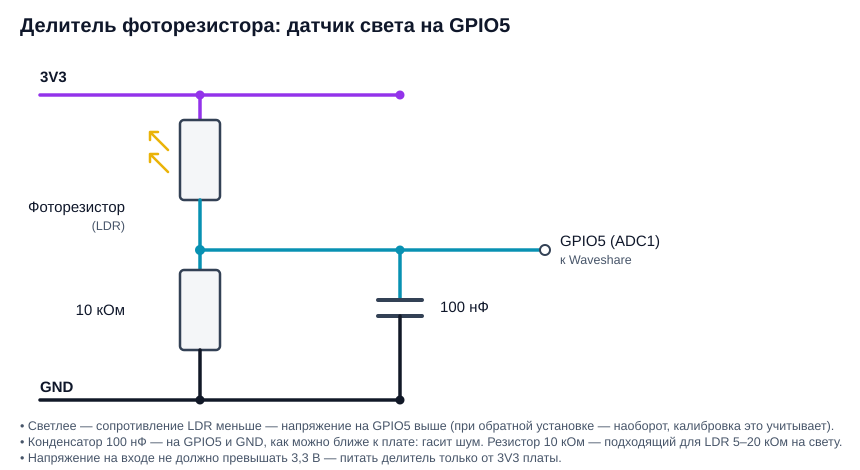
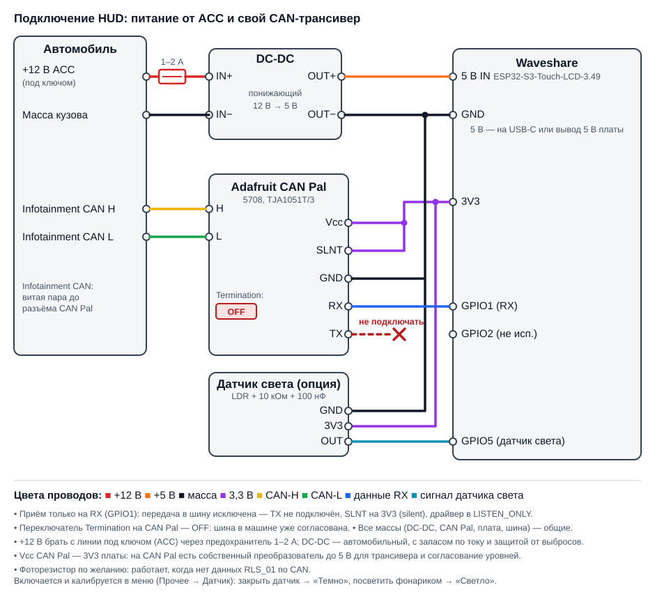

# HUD для Audi A4 B9 (MLB-Evo) на Waveshare ESP32-S3-Touch-LCD-3.49

Самодельный проекционный дисплей (HUD) с живыми данными автомобиля: скорость,
передача, круиз и лимитер, Lane Assist, знаки, поворотники, двери и стрелки навигации.
Данные слушаются пассивно на шине I-CAN (инфотейнмент), в шину ничего не передаётся.

[English version](README.md)

> **Источник данных** — сниффер / BLE-гейт: [esp32-CAN-sniffer-logger-screener](https://github.com/WARMW00D/esp32-CAN-sniffer-logger-screener).
> Там же описан упрощённый CAN→BLE-гейт для HUD (без SD-карты, питание от ACC).

---

## Содержание

1. [Что показывает HUD](#что-показывает-hud)
2. [Архитектура](#архитектура)
3. [Железо](#железо)
4. [Сборка прошивки](#сборка-прошивки)
5. [Настройки `hud_config.h`](#настройки-hud_configh)
6. [Раскладка экрана](#раскладка-экрана)
7. [Источники данных (CAN)](#источники-данных-can)
8. [Протокол сниффер → HUD по BLE](#протокол-сниффер--hud-по-ble)
9. [Графика: шрифты и картинки](#графика-шрифты-и-картинки)
10. [Проверка без машины и диагностика](#проверка-без-машины-и-диагностика)
11. [Решение проблем](#решение-проблем)
12. [Структура файлов](#структура-файлов)
13. [Что не проверено и планы](#что-не-проверено-и-планы)
14. [Безопасность и правовые оговорки](#безопасность-и-правовые-оговорки)
15. [Благодарности](#благодарности)

---

## Что показывает HUD

| Элемент | Поведение |
|---|---|
| **Скорость** | Как на приборке (`KBI_V_Digital`), крупно, по правому краю |
| **Режим КП и передача** | Серым над скоростью: `P`, `R`, `N`, `D`, `S`, `M`, `E`, `Offroad`; в D/S/M с номером: `D5`, `M3` |
| **ACC** | Значок установки скорости + заданная скорость. Пассив — приглушённо, активен — ярко. В пассиве без заданной скорости ACC не показывается |
| **Лимитер** | Надпись `LIM` на месте значка ACC + скорость лимитера. Серая без числа — включён, скорость не задана |
| **Режим пробки** | Значок трёх машин рядом со скоростью ACC: серый — готов, зелёный — активен, оранжевый — предупреждение |
| **Значок ACC / Lane Assist** | Собирается из слоёв: своя машина, машина впереди (цель ACC — цветом ACC; при `ACC_Relevantes_Objekt_02` = 2, опасной дистанции, — **красная и даже при выключенном ACC**), волны радара, боковые полосы LKA (зелёные/жёлтые/оранжевые — состояние Lane Assist; своя машина серая, пока не включён ACC или не показано опасное сближение; красные полосы Side Assist приоритетнее) |
| **Lane Assist** | Каждая боковая полоса красится отдельно по `LDW_02`: зелёная — линия видна, жёлтая — линия не видна, оранжевая мигающая — предупреждение о выходе за линию. Своя машинка на значке остаётся серой (её цвет задаёт только ACC) |
| **Side Assist** | Полоски полос на значке ассистентов — красные, **даже если Lane Assist и ACC выключены**: машина в мёртвой зоне — полоска горит, попытка перестроения — мигает и HUD пикает (повтор раз в 1.2 с, пока держится) |
| **Знаки ограничения** | Круг 64 px, красное кольцо, цифры Roboto Condensed Bold. Источник по приоритету: **PSD** (прогноз маршрута MIB) явный знак → `VZE_01` → PSD «по правилам» (город 60 / вне 90 / магистраль 110). PSD работает и когда приборка знаков не показывает. Несколько знаков (доп. знаки VZE, «обгон запрещён») — по очереди через 1 с |
| **Превышение** | Красная обводка цифр скорости: проявляется с 75 % допуска превышения и полностью красная на 100 % (допуск по умолчанию 20 км/ч) |
| **Поворотники** | Картинки-стрелки поверх остальных элементов внизу экрана. Зелёные — поворот, **красные — аварийка** |
| **Двери, капот, багажник** | Вид машины сверху на месте стрелки навигации, открытые элементы красные |
| **Навигация** | Стрелка манёвра (39 вариантов), следующий манёвр маленькой серой стрелкой в углу, дистанция до манёвра, бар-граф 16 сегментов, дистанция и время до цели |
| **Pre sense** | Красный треугольник с «!» и надпись PreSense на месте стрелки, главнее дверей и навигации. Предупреждение — горит, острое / торможение — мигает |
| **Яркость** | Освещённость × колёсико. Освещённость — датчик `RLS_01` (до 6126 лк, выше — по `Boost`, до ~30000 лк), логарифмически; колёсико — `BCM1_04` (1–100 %), линейно. Четыре угла: темно 90 / 110, солнце 200 / 255 (колёсико мин / макс). Нет данных `RLS_01` — используется необязательный фоторезистор на GPIO5, затем оценка по `Dimmung_01` приборки |
| **Язык и единицы** | Русский / английский, км / мили. По умолчанию — `HUD_LANG` и `HUD_UNITS` в `hud_config.h`, на ходу — `hud_set_lang()` / `hud_set_units()` (под будущее меню и голосовое управление) |
| **Бар ускорения** | По нижнему краю под стрелкой навигации квадраты расходятся из центра: зелёные — разгон, красные — торможение. По CAN: `ESP_02` (продольное ускорение), если он есть на I-CAN, иначе производная скорости `Kombi_01`. Полная шкала: разгон 0–100 км/ч за 9 с (3.09 м/с²), торможение 6 м/с² |
| **Сколько заправить** | Над зоной скорости слева, на линии режима КП: значок колонки и «13 л» / «3.4 gal» — сколько войдёт до полного бака: `HUD_TANK_L` (54 л) × (100 − уровень % из `BAP_BC` fct 0x1C). Литры / галлоны США — в меню |
| **Расход топлива** | Тёмно-серая полоска 5 px у правого края, снизу вверх 0–20 л/100 км, больше 20 — мигает. Средний — «с момента запуска» бортового компьютера приборки (`BAP_BC`), показывается с любой скорости. Мгновенный — только если на шине есть `Motor_04` (на I-CAN не найден), от 35 км/ч |
| **Звук** | Стартовый звук при включении (свой, синтезирован `tools/synth_startup.py`). Кодек ES8311 и усилитель на плате, своя задача FreeRTOS — от отрисовки не зависит |
| **Меню настроек** | Двойное касание экрана (`HUD_MENU_DOUBLE_TAP 0` — одиночное), **только на стоящей машине**: тронулись — меню закрывается. Язык, единицы (км / мили), объём топлива (литры / галлоны), расход (мгновенный / средний) — показаны все варианты, активный зелёный, остальные серые. VZE, PSD, разгон — переключатели: зелёный вкл, красный выкл (VZE и PSD можно оба). «Звук» (0–100) и «Допуск» превышения (0–20 км/ч) — по нажатию поверх меню открывается панель с ползунком и кнопками − / + (громкость сразу озвучивается пробным сигналом). «Датчик» открывает панель калибровки фоторезистора (см. «Железо»). Выбор сохраняется во флеше (NVS); меню закрывается кнопкой ✕ или само через 10 с без касаний |
| **Обновление прошивки (OTA)** | Удержите **BOOT** 1,5 с на стоящей машине: HUD перезагрузится в режим обновления — точка доступа Wi-Fi `HUD-Update`, на экране пароль, адрес `http://192.168.4.1` и полоса прогресса. Загрузите `.bin` на странице, HUD запишет его и перезагрузится. См. [Обновление по Wi-Fi](#6-обновление-по-wi-fi-ota) |
| **Индикатор источника данных** | Внизу слева, под стрелкой навигации. Серый значок Bluetooth с точками — идёт подключение к снифферу; тёмно-синий значок — BLE подключён; тёмно-зелёная надпись **CAN** — кадры идут со своего трансивера CAN Pal. Если данных нет и подключаться не к чему — скрыт |

Любое поле, по которому давно не было данных, **скрывается**, а не показывает
устаревшее значение (таймауты — в разделе [Источники данных](#источники-данных-can)).

---

## Архитектура

```
Audi I-CAN (500 кбит/с)
      │  TWAI LISTEN_ONLY
      ▼
┌────────────────────────────┐      BLE, NimBLE          ┌───────────────────────────────┐
│ Сниффер                    │  ACL-поток сырых кадров   │ HUD (этот проект)             │
│ ESP32-S3 + TJA1051T/3      │ ────────────────────────► │ Waveshare ESP32-S3 3.49"      │
│ пишет полный лог на SD     │ ◄──────────────────────── │ декодирует кадры → HudData    │
│ фильтрует по ACL от HUD    │   список правил (ACL)     │ LVGL 8 рисует экран           │
└────────────────────────────┘                           └───────────────────────────────┘
```

- **Сниффер ничего не расшифровывает.** Он отдаёт сырые CAN-кадры, прошедшие фильтр,
  который прислал HUD. Вся расшифровка — в HUD (`can_decode.c`).
- HUD после **каждого** подключения заново пишет список правил: сниффер сбрасывает его
  при отключении клиента.
- Источник выбирается в `hud_config.h` (`HUD_DATA_SOURCE`). По умолчанию `HUD_SRC_AUTO`: работают оба;
  пока по своему трансиверу CAN Pal идут кадры — используется он, а BLE отключается; CAN замолчал —
  HUD подключается к снифферу / гейту по BLE. Кадры из обоих источников идут в один `can_decode_frame()`.

### Потоки внутри HUD

| Где | Что делает |
|---|---|
| Задача `ble_can` (ядро 1) | Скан, подключение, запись ACL. Колбэк уведомлений разбирает пачки и вызывает `can_decode_frame()` |
| `can_decode.c` | Разбор сигналов и сборка BAP в `HudData` под `portMUX`. Для каждого поля — метка времени |
| Задача LVGL (ядро 0) | `lv_timer` раз в 50 мс берёт снимок `hud_data_snapshot()` и обновляет виджеты |
| `loop()` | Ничего не делает. **LVGL трогается только из `lv_timer`** — иначе гонка между ядрами |

Биты свежести (`valid`) считаются в момент снимка по таймаутам. Время берётся **внутри**
критической секции — иначе кадр, пришедший на другом ядре, давал «отрицательный» возраст
и поле мигало.

---

## Железо

| Узел | Что |
|---|---|
| Дисплей | Waveshare **ESP32-S3-Touch-LCD-3.49 V2**, 172×640, используется в альбомной ориентации 640×172 |
| Сниффер | ESP32-S3 (Super Mini или WROOM) + трансивер TJA1051T/3, прошивка сниффера **2.6.0+** (протокол ACL) — [esp32-CAN-sniffer-logger-screener](https://github.com/WARMW00D/esp32-CAN-sniffer-logger-screener) |
| BLE-гейт | Упрощённый вариант сниффера только для HUD: ESP32-S3 Super Mini + TJA1051T/3, без SD и RTC, питание от ACC. Тот же BLE-протокол — описан в том же [репозитории](https://github.com/WARMW00D/esp32-CAN-sniffer-logger-screener) |
| Свой CAN-трансивер | Adafruit CAN Pal (5708, TJA1051T/3) — по желанию, вместо BLE-сниффера / шлюза, см. ниже |
| Питание | DC-DC 12 В → 5 В (от 3 А) от линии под ключом (ACC) через предохранитель 1–2 А |
| Стенд | Проигрыватель логов на ESP32-S3-WROOM CAM: отдаёт записанный лог с SD по BLE с теми же UUID и ACL, что у сниффера |


### Свой трансивер: Adafruit CAN Pal (5708, TJA1051T/3)

Источник `HUD_SRC_TWAI`: HUD сам слушает I-CAN встроенным контроллером TWAI, BLE-гейт не нужен.

| CAN Pal | Куда | Зачем |
|---|---|---|
| **Vcc** | 3V3 платы | на CAN Pal есть свой накачивающий преобразователь до 5 В для трансивера |
| **GND** | GND платы | |
| **RX** | **GPIO1** (`HUD_CAN_RX_PIN`) | единственный провод данных |
| **TX** | **не подключать** | внутренняя подтяжка TJA1051 держит рецессив — передать в шину физически нечем |
| **SLNT** | **3V3** | передатчик TJA1051 выключен (silent mode) |
| **H / L** (клеммник) | CAN-H / CAN-L шины I-CAN | витая пара |
| средняя клемма | не нужна | на плате она уже соединена с GND CAN Pal |
| переключатель **Termination** | **OFF** | шина в машине уже согласована, лишние 120 Ом её портят |

Защита от передачи в шину — в три слоя: режим `LISTEN_ONLY`, неподключённый TX и SLNT на 3V3.

Драйвер TWAI требует указать пин TX (`HUD_CAN_TX_PIN` = **GPIO2**), но в `LISTEN_ONLY` он всегда рецессивный. GPIO2 на разъёме оставить свободным.

Выбор пинов — по таблице GPIO платы: заняты LCD (9–14, 17, 18, 21, 42), SD (38–41), IMU/RTC/аудио I²C (47, 48), I2S (6, 7, 15, 45, 46), батарея (4), EXIO (8), SYS_OUT (16), USB (19, 20), UART0 (43, 44); strapping — 0, 3, 45, 46. Полностью свободны GPIO1, 2, 5. GPIO1 — RX CAN, GPIO2 — заглушка TX для TWAI, **GPIO5 (ADC1) занят необязательным фоторезистором** (см. ниже).

### Необязательный фоторезистор (датчик света)

Запасной датчик освещённости на случай, когда `RLS_01` не приходит по CAN (стенд, другой шлюз). Собирается делитель: **фоторезистор** между 3V3 и **GPIO5**, **10 кОм** между GPIO5 и GND, **100 нФ** с GPIO5 на GND. Полярность любая — калибровка сама определяет направление.

Включение и калибровка — в меню: **Прочее → Датчик**. Полностью закройте датчик и нажмите «1», затем посветите ярким фонариком и нажмите «2», затем «Сохранить» (датчик включится автоматически; если разница меньше `HUD_LDR_MIN_SPAN_MV`, калибровка отклоняется). В этой же панели есть кнопка вкл / выкл. Калибровка и состояние хранятся во флеше. Пин и значения по умолчанию — `HUD_LDR_*` в `hud_config.h`. Измерение в мВ (ADC1, 11 дБ, среднее из 8 отсчётов, сглаживание); освещённость между «темно» и «светло» переводится линейно и подаётся в ту же логарифмическую формулу яркости, что и `RLS_01`.



Английская версия: [`schematic/HUD_light_sensor_divider_en.svg`](schematic/HUD_light_sensor_divider_en.svg).

### Схема подключения

Питание (DC-DC 12 В → 5 В), CAN Pal, необязательный датчик света и плата дисплея:



Английская версия: [`schematic/HUD_wiring_CAN_DCDC_en.svg`](schematic/HUD_wiring_CAN_DCDC_en.svg).
Провод TX на CAN Pal сознательно **не подключается**.

### Корпус

Корпус для 3D-печати лежит в [`case/`](case): `hud_front` и `hud_rear` в форматах `.step` и `.stl`.
Вырез под USB-порт показан на `case/hud_usb_port.png`.


> **Совет:** на платах, которые стоят в салоне, стоит убрать все ненужные светодиоды —
> ночью они бликуют в стекле и отвлекают.

---

## Сборка прошивки

### 1. Библиотеки

| Библиотека | Версия | Примечание |
|---|---|---|
| ESP32 Arduino core | как в пакете примеров Waveshare | настройки платы — по вики Waveshare для этой модели |
| **lvgl** | **8.x** (проверено на 8.4.0) | через Library Manager |
| **NimBLE-Arduino** | **2.x** (API проверен по 2.5.1) | в 1.x другие сигнатуры колбэков |
| SensorLib | из пакета Waveshare | нужна BSP |

### 2. `lv_conf.h`

Файл кладётся **рядом** с папкой `lvgl` в `Documents\Arduino\libraries\`, не внутрь неё.
Критичные настройки:

```c
#define LV_COLOR_DEPTH          16
#define LV_MEM_SIZE             (48U * 1024U)   // хватает
#define LV_USE_FONT_COMPRESSED  1               // ОБЯЗАТЕЛЬНО, иначе шрифты HUD не рисуются
#define LV_USE_LOG              1               // по желанию, для диагностики
#define LV_USE_LINE             1               // диагональ «конец ограничения»
```

`LV_USE_FONT_COMPRESSED` — главная ловушка: `lv_font_conv` по умолчанию сжимает битмапы,
а без этого флага LVGL молча не рисует текст. Ошибку видно только с `LV_USE_LOG 1`.

### 3. BSP

Основа — пример `Arduino/examples/09_LVGL_V8_Test` из архива Waveshare
`ESP32-S3-Touch-LCD-3.49-V2`. Изменения относительно примера:

- `user_config.h`: `Rotated = USER_DISP_ROT_90` (альбомная ориентация);
- `lvgl_port.c`: вместо `lv_demo_widgets()` вызывается `build_hud_mockup()`,
  убран `#include "demos/lv_demos.h"`.

### 4. Таблица разделов (нужна для OTA)

В Arduino IDE: **Инструменты → Partition Scheme → «16M Flash (3MB APP/9.9MB FATFS)»** (два слота приложения по 3 МБ). Без двух слотов OTA работать не может. Смена схемы требует одной прошивки по USB; настройки во флеше (NVS) при этом могут сброситься.

### 5. Сборка

Открыть `waveshare_hud_mockup/waveshare_hud_mockup.ino` в Arduino IDE, выбрать плату и порт, собрать и
прошить. Serial — 115200.

Для BLE с сопряжением сначала скопируйте `waveshare_hud_mockup/secrets.example.h` в `secrets.h` в той же папке и задайте `BLE_PASSKEY` (см. «Сопряжение по коду доступа» ниже). Без `secrets.h` скетч тоже соберётся, защита сопряжением будет выключена.

---

### 6. Обновление по Wi-Fi (OTA)

1. В Arduino IDE: **Скетч → Экспорт скомпилированного двоичного файла**. Нужен файл `waveshare_hud_mockup.ino.bin` из папки `build` рядом со скетчем (не `bootloader`, `partitions` и не `merged`).
2. Остановите машину, удержите **BOOT** на HUD 1,5 с (звуковой сигнал, затем перезагрузка). Нажатие BOOT на ходу игнорируется.
3. На экране HUD: сеть Wi-Fi `HUD-Update`, пароль и адрес. Подключите телефон или ПК к этой сети и откройте `http://192.168.4.1` (страница открывается и по любому другому адресу — HUD перенаправляет на неё).
4. Выберите `.bin`, нажмите «Загрузить». Прогресс виден на странице и на HUD. После успешной загрузки HUD перезагрузится уже с новой прошивкой.
5. Выйти без обновления — снова нажать BOOT; режим обновления сам закрывается через 5 минут без загрузки.

Пароль Wi-Fi — `HUD_OTA_PASS` из `secrets.h` (по умолчанию `hud12345`, смените). В режиме обновления CAN, BLE и звук не работают, поэтому он только для стоящей машины. Прерванная загрузка ничего не ломает: новый образ становится активным только после полной записи, старая прошивка остаётся. Неверный файл (не образ прошивки) обновлятор отклонит.

---

## Настройки `hud_config.h`

| Параметр | По умолчанию | Смысл |
|---|---|---|
| `HUD_DATA_SOURCE` | `HUD_SRC_AUTO` | источник кадров: `HUD_SRC_AUTO` — свой трансивер CAN Pal, если по нему идут кадры, иначе BLE от сниффера / гейта; `HUD_SRC_BLE` — только BLE; `HUD_SRC_TWAI` — только свой трансивер; `HUD_SRC_FAKE` — встроенный генератор |
| `HUD_BLE_PAIR_MSG_AFTER` | `3` | столько неудач сопряжения подряд — подсказка на экране (код доступа — в `secrets.h`) |
| `HUD_AUTO_CAN_HOLD_MS` | `1000` | AUTO: столько мс без кадров по CAN — переход на BLE |
| `HUD_CAN_RX_PIN` / `HUD_CAN_TX_PIN` | `1` / `2` | пины TWAI (только для `HUD_SRC_TWAI`), см. «Свой трансивер» |
| `HUD_CAN_BITRATE_K` | `500` | скорость шины, кбит/с |
| `HUD_BLINK_FROM_TAKT` | `1` | `1` — мигать по биту такта приборки (фаза как на приборке). `0` — бит такта только признак «включён», мигаем своим таймером 500/500 мс |
| `HUD_LANG` | `HUD_LANG_RU` | язык подписей: `HUD_LANG_RU` (км/ч, км, м, ч) или `HUD_LANG_EN` (km/h, km, m, h) |
| `HUD_UNITS` | `HUD_UNITS_KM` | `HUD_UNITS_MI` — скорость (в т. ч. ACC и лимитер) в mph, дистанции в mi/ft. Знаки не пересчитываются |
| `HUD_ACCEL_BAR` | `0` | бар ускорения при первом запуске (дальше — из меню) |
| `HUD_ACCEL_REF_KMH` / `HUD_ACCEL_REF_SEC` | `100` / `9` | полная шкала: разгон 0…REF км/ч за REF с |
| `HUD_BRAKE_FULL_MS2` | `6` | полная шкала торможения, м/с² |
| `HUD_ACCEL_ON` / `HUD_ACCEL_OFF` | `0.40` / `0.20` | гистерезис, м/с²: бар загорается выше ON и гаснет ниже OFF; смена разгон ↔ торможение только через «пусто» |
| `HUD_ACCEL_SMOOTH_MS` | `600` | сглаживание ускорения |
| `HUD_ACCEL_GAIN` | `0.25` | чувствительность бара (0.25 — в 4 раза спокойнее шкал выше) |
| `HUD_FUEL_BAR` / `HUD_FUEL_FULL` | `1` / `20` | полоска расхода и её полная шкала, л/100 км |
| `HUD_FUEL_AVG` | `1` | при первом запуске: `1` средний (бортовой компьютер приборки), `0` мгновенный (дальше — из меню) |
| `HUD_FUEL_ON_KMH` / `HUD_FUEL_OFF_KMH` | `35` / `30` | расход появляется от 35 км/ч и пропадает ниже 30 (гистерезис) |
| `HUD_LOG_TO_SD` | `0` | журнал (всё, что идёт в Serial) ещё и на SD-карту. Запись начинается после получения даты/времени по CAN: `/logs/ГГГГ-ММ-ДД/log_ЧЧ_N.txt`, каждый час — новый файл, N растёт при перезапуске в тот же час; строки с меткой `[ЧЧ:ММ:СС.мс]`, до прихода часов — `[+мс]` |
| `HUD_LOG_SD_MAX_MB` | `50` | больше — следующий файл (N+1) в том же часе |
| `HUD_SWA` / `HUD_SWA_BEEP` | `1` / `1` | Side Assist на значке / звук при предупреждении |
| `HUD_SWA_BEEP_REPEAT_MS` | `1200` | повтор звука, пока предупреждение держится |
| `HUD_SOUND_ENABLE` | `1` | `0` — звук полностью выключен, кодек не инициализируется |
| `HUD_SOUND_STARTUP` | `1` | стартовый звук при включении |
| `HUD_SOUND_STARTUP_DELAY_MS` | `300` | пауза перед стартовым звуком |
| `HUD_SOUND_VOLUME` | `25` | громкость 0…100 при первом запуске (дальше из меню, хранится во флеше; на ходу — `hud_sound_set_volume()`) |
| `HUD_PSD_LIMITS` / `HUD_VZE_SIGNS` | `1` / `1` | знаки из PSD / из VZE_01 при первом запуске (дальше — из меню) |
| `HUD_PSD_LEGAL_DELAY_MS` | `1000` | задержка смены «явный знак» → «по правилам» |
| `HUD_SIGN_CYCLE_MS` | `1000` | несколько знаков — по очереди, каждый столько мс |
| `HUD_OVERSPEED_TOL_KMH` / `HUD_OVERSPEED_START` | `20` / `75` | допуск превышения при первом запуске, км/ч (0…20, дальше из меню; в милях тоже в км/ч), и с какого % допуска начинает проявляться обводка |
| `HUD_TOUCH_ENABLE` | `1` | касание экрана — меню настроек; `0` — тач не опрашивается |
| `HUD_MENU_DOUBLE_TAP` / `HUD_DOUBLE_TAP_MS` | `1` / `400` | меню по двойному касанию (окно для второго касания, мс); `0` — по одиночному |
| `HUD_MENU_ONLY_STOPPED` / `HUD_MENU_MAX_KMH` | `1` / `0` | меню только при скорости не больше 0 км/ч (нет данных о скорости — можно) |
| `HUD_MENU_TIMEOUT_MS` | `10000` | меню закрывается само через 10 с без касаний |
| `HUD_VOLUME_GAL` / `HUD_TANK_L` | `0` / `54` | «сколько заправить» в галлонах при первом запуске (дальше — меню) / объём бака, л |
| `HUD_SNIFFER_NAME` | `"S3-CAN-Sniffer"` | имя сниффера в эфире |
| `HUD_LOG_BLE` | `1` | `[BLE]` подключение к снифферу, запись и проверка ACL, ошибки |
| `HUD_LOG_SRC` | `1` | `[src]` какой источник сейчас используется (AUTO) |
| `HUD_LOG_STAT` | `0` | `[BLE]` раз в 10 с: кадров, потери, макс. пауза скорости |
| `HUD_LOG_CAN` | `0` | `[CAN]` раз в 10 с: счётчики и последние данные по каждому ID |
| `HUD_LOG_DIM` | `0` | `[dim]` раз в 10 с: данные `Dimmung_01` и выставленная подсветка |
| `HUD_LOG_BAP` | `0` | `[nav]` каждая смена манёвра навигации (всё сообщение 0x17 в hex), неизвестные коды MainElement; `[bap]` — изменения нераспознанных функций Navigation_SD (для исследований) |
| `HUD_LOG_HUD` | `1` | `[hud]` построение экрана, пропадание скорости по таймауту |
| `HUD_LOG_LVGL` | `1` | `[LVGL]` сообщения LVGL (нужен ещё `LV_USE_LOG 1`) |
| `LKA_MIN_INTERVAL_MS` | `500` | интервал для `LDW_02` в ACL |
| `HUD_BR_DARK_WHEEL_MIN` / `_MAX` | `90` / `110` | подсветка в темноте при колёсике на минимуме / максимуме |
| `HUD_BR_BRIGHT_WHEEL_MIN` / `_MAX` | `200` / `255` | на солнце при колёсике на минимуме / максимуме |
| `HUD_LIGHT_LUX_DARK` / `_BRIGHT` | `0` / `30000` | освещённость, лк, которая считается «темно» / «солнце» |
| `HUD_WHEEL_DEFAULT` | `100` | положение колёсика, пока оно не пришло по CAN |
| `HUD_BRIGHT_NO_DATA` | `170` | подсветка без данных о свете |
| `HUD_BRIGHT_STEP` | `4` | плавность: шаг изменения за 50 мс |
| `HUD_OTA_BTN_PIN` / `HUD_OTA_HOLD_MS` | `0` / `1500` | OTA: пин BOOT (GPIO0) и сколько его удерживать, мс |
| `HUD_OTA_SSID` | `"HUD-Update"` | OTA: имя точки доступа (пароль — `HUD_OTA_PASS` в `secrets.h`) |
| `HUD_OTA_TIMEOUT_MS` | `300000` | OTA: режим обновления сам закрывается через это время без загрузки |
| `HUD_LDR_PIN` | `5` | вход АЦП фоторезистора (только ADC1: GPIO1…10) |
| `HUD_LDR_ON` | `0` | первый запуск: `1` — фоторезистор включён (дальше из меню) |
| `HUD_LDR_DARK_MV` / `HUD_LDR_BRIGHT_MV` | `150` / `2500` | калибровка по умолчанию, мВ (заменяется калибровкой из меню) |
| `HUD_LDR_MIN_SPAN_MV` | `300` | минимальная разница «светло» − «темно» при калибровке, мВ |

---

## Раскладка экрана

Экран 640×172. Координаты — левый верхний угол элемента.

| Элемент | x, y | Размер | Шрифт / картинка |
|---|---|---|---|
| Знак ограничения | 1, 2 | круг 64, кольцо 7 | `hud_font_sign2` (2 цифры), `hud_font_sign3` (3 цифры) |
| Значок ACC / LKA | 68, 5 | 64×54 | 5 масок-слоёв `img_assist_*` |
| Стрелка навигации / машинка | 145, 5 | 192×140 | стрелка 192×116 + строка дистанции под ней (`hud_font_route`) |
| Бар-граф дистанции | 339, до y=145 | 16 сегм. 14×7, шаг 9 | — |
| Маршрут: значок / текст | 5, 132 / 25, 128 | 2 строки | `hud_font_route` |
| Индикатор источника данных | x = 290, от нижнего края −2 px (`LINK_BOTTOM_MARGIN`) | — | `LV_SYMBOL_BLUETOOTH` / текст `CAN` |
| Режим КП | 376…626, y=1 | правый край по цифрам скорости | `hud_font_gear` |
| Скорость | 376…632, y=20 | ширина 256, выравнивание вправо | `hud_font_speed` |
| Значок ACC / надпись LIM | 364, 145 / 364, 149 | 29×26 / 31×13 | `img_acc_set` / `img_limiter` |
| Скорость ACC / лимитера | 398, 146 | — | `hud_font_small` |
| Режим пробки | 462, 148 | 40×22 | `img_traffic_jam` |
| Подпись `km/h` (серая) | 515, 136 | — | `hud_font_kmh` |
| Мигалки | 2, 119 и 592, 119 | 46×46 | обводка + заливка, поверх всего |

Ширина N цифр шрифта скорости при высоте цифр H: `H × N × 0.967`
(табличные цифры Montserrat Bold: ширина 700 при высоте 724 единицы).

---

## Источники данных (CAN)

Все сигналы — Intel (little-endian). Извлечение:

```c
static inline uint32_t sig(const uint8_t *d, int start, int len) {
    uint64_t raw = 0; for (int i = 7; i >= 0; i--) raw = (raw << 8) | d[i];
    return (raw >> start) & ((1ULL << len) - 1);
}
```

### Обычные кадры (11 бит)

| Что | ID | Сообщение | Сигнал | start\|len | Масштаб / значения | Проверено |
|---|---|---|---|---|---|---|
| Скорость | 0x30B | Kombi_01 | KBI_V_Digital | 24\|9 | ×1 км/ч | ✅ |
| ACC заданная | 0x2A6 | ACC_12 | ACC_Wunschgeschw_02 | 12\|10 | ×0.32 км/ч, 1023 = нет | ✅ |
| Лимит из ACC | 0x2A6 | ACC_12 | ACC_Tempolimit | 0\|5 | таблица в `vze_table.h` | ⚠️ |
| Цель впереди | 0x2A6 | ACC_12 | ACC_Relevantes_Objekt_02 | 45\|2 | 0 нет, 1 машина, 2 предупр., 3 пассив | ⚠️ |
| Дистанция ACC | 0x2A6 | ACC_12 | ACC_Gesetzte_Zeitluecke | 37\|3 | 1…5 (декодируется, не рисуется) | ⚠️ |
| Удержание в полосе | 0x2A6 | ACC_12 | ACA_Querfuehrung | 7\|2 | 2 = активно | ⚠️ |
| Режим пробки | 0x2A6 | ACC_12 | STA_Primaeranz | 62\|2 | 1 готов, 2 активен, 3 предупр. | ⚠️ |
| Статус ACC | 0x2A8 | ACC_14 | ACC_Status_Anzeige | 16\|3 | 2 пассив, 3 активен, 4 превышение водителем | ✅ |
| Лимитер | 0x31E | — (нет в K-матрице) | заданная скорость | 12\|10 | ×0.32 км/ч, **1022 выкл**, 1023 вкл без скорости | ✅ на стоянке |
| Режим КП | 0x394 | WBA_03 | WBA_Fahrstufe_02 | 12\|4 | 1 P, 2 R, 3 N, 4 D, 5 S, 6 M, 8 E, 12 Offroad | ✅ |
| Номер передачи | 0x394 | WBA_03 | WBA_eing_Gang_02 | 24\|4 | 1…9 | ✅ D1…, ⚠️ 8-я |
| Поворотники | 0x366 | Blinkmodi_02 | такт лев / прав, аварийка | 27, 28, 20 | бит | ✅ |
| Знак | 0x181 | VZE_01 | VZE_Verkehrszeichen_1 | 11\|8 | код; ограничение = 5 × код (8 → 40, 12 → 60, 16 → 80) | ✅ три точки |
| Знак: не показывать / превышение | 0x181 | VZE_01 | Anzeigeunterdrueck_1 / Warnung_1 | 50 / 35 | бит | ⚠️ |
| Lane Assist | 0x397 | LDW_02 | LED зелёный / жёлтый | 62 / 61 | бит | ⚠️ зелёный в движении не приходит; для цветов не используется |
| Линии LKA | 0x397 | LDW_02 | Lernmodus_links / _rechts | 38\|2 / 36\|2 | 0 выкл, 1 не видна, 2 видна, 3 выход | ✅ 0→1 при включении |
| Предупреждение LKA | 0x397 | LDW_02 | Warnung_links / _rechts | 56 / 57 | бит | ⚠️ |
| Двери, багажник | 0x583 | ZV_02 | ZV_FT/BT/HFS/HBFS/HD_offen | 24…28 | бит | ✅ |
| Капот | 0x65A | BCM_01 | BCM1_MH_Schalter | 31 | бит | ✅ |
| Ускорение | 0x101 | ESP_02 | ESP_Laengsbeschl | 24\|10 | ×0.03125 − 16 м/с² | ❌ на I-CAN не найден (opendbc MLB); используется запасной вариант |
| Ускорение (запасное) | 0x30B | Kombi_01 | KBI_angez_Geschw (производная) | 48\|10 | ×0.32 км/ч | ✅ раскладка |
| Тормоза | 0x106 | ESP_05 | ESP_Bremsdruck / ESP_Fahrer_bremst | 16\|10 / 26 | ×0.3 − 30 бар / бит | ❌ на I-CAN не найден (opendbc MLB) |
| PSD: сегменты | 0x462 | PSD_04 | Segment_ID / Vorgaenger / Segmentlaenge / Strassenkategorie / Bebauung | 0\|6 / 6\|6 / 12\|7 / 19\|3 / 43 | длина ×2 м | ✅ поездки 29.09 |
| PSD: позиция | 0x463 | PSD_05 | Pos_Segment_ID / Pos_Segmentlaenge (остаток) | 0\|6 / 6\|7 | ×2 м | ✅ |
| PSD: ограничения | 0x464 | PSD_06 mux 2 | Ges_Segment_ID / Offset / Geschwindigkeit / Typ / Ueberholverbot / Gesetzlich_Kategorie | 3\|6 / 9\|7 / 16\|5 / 21\|2 / 49\|2 / 56\|3 | код → км/ч (нижняя граница), 23 — конец | ✅ |
| Бортовой компьютер | 0x17330F10 (29 бит) | BAP_BC, LSG 0x0F, от приборки | fct 0x18 «с момента запуска» / 0x19 долговременная: [0–1] расход ×0.1 л/100 (0xFFFF — нет), [6–7] пробег ×0.1 км, [11] время, мин, [15–16] ср. скорость ×0.1; 0x16 запас хода, км; 0x17 одометр ×0.1 км; 0x1C топливо, % | LE | ✅ поездки 0006/0010 |
| Side Assist | 0x30F | SWA_01 | SWA_Infostufe_SWA_li / _re, SWA_Warnung_SWA_li / _re | 26 / 42, 27 / 43 | бит: машина в мёртвой зоне / предупреждение | ⚠️ opendbc MLB, на I-CAN проверить |
| Колёсико подсветки | 0x64F | BCM1_04 | BCM1_Stellgroesse_Kl_58s | 25\|7 | 1–100 % | ✅ лог 0003 |
| Датчик света | 0x5A0 | RLS_01 | LS_Helligkeit_FW / LS_Helligkeit_IR / RLS_Vorfeldhelligkeit_Boost / RS_Regenmenge | 8\|10 / 0\|8 / 35\|4 / 24\|4 | ×6 лк (≤1021) / ×400 лк / 0–15 / ×10 % | ✅ поездки 0006/0010 |
| Дата и время | 0x6B2 | Diagnose_01 | UH_Jahr / Monat / Tag / Stunde / Minute / Sekunde | 28\|7 / 35\|4 / 39\|5 / 44\|5 / 49\|6 / 55\|6 | год +2000 | ⚠️ opendbc; кадр есть на I-CAN |
| Расход | 0x107 | Motor_04 | MO_KVS (счётчик, мкл) | 48\|15 | переполнение на 32768 | ❌ на I-CAN не найден (opendbc MLB) |
| Pre sense | 0x2A9 | ACC_15 | AWV_Warnung | 16\|3 | 0 нет, 1 латентное, 2 предупр., 3 острое, 4 торможение, 5 перехватите управление, 6 при повороте | ⚠️ из opendbc MQB |
| Яркость | 0x5F0 | Dimmung_01 | DI_KL_58xd / DI_Display_Nachtdesign | 0\|8 / 15 | итоговая яркость дисплеев 10–100 % (254 Init, 255 ошибка) / ночной дизайн | ✅ лог 0003, колёсико |

`LDW_02`: биты 12–15 (`LDW_Gong`, `LDW_SW_Warnung_*`) **не использовать** — на этой машине
байт 1 постоянно `0x40`. На стоянке при включении LKA индикаторы 61/62 не меняются, линии
переходят в 1 — поэтому «LKA включён» = любая линия не 0. Цвета полос берутся только из двух
2-битных значений линий (1 = не видна → жёлтая, 2 = видна → зелёная, 3 = выход → оранжевая).

### Навигация: BAP Navigation_SD (29 бит)

ID `0x17333210` и `0x17333211` (MIB → дисплеи). Кадрирование BAP:

- `b0.bit7 = 0` — одиночный кадр: заголовок `b0<<8 | b1`, данные с байта 2;
- `b0 = 10cc LLLL` — старт многокадрового: длина `(b0&0xF)<<8 | b1`, заголовок в b2..b3;
- `b0 = 11cc SSSS` — продолжение, канал `cc`, номер `SSSS`.

Заголовок: `opcode = hdr>>12 & 7` (3 — HeartbeatStatus, 4 — Status), `lsg = hdr>>6 & 0x3F`
(должен быть `0x32`), `fct = hdr & 0x3F`.

| fct | Функция | Что берётся |
|---|---|---|
| 0x11 | RG_Status | 1 = маршрут ведётся (главный признак показа навигации) |
| 0x12 | DistanceToNextManeuver | дистанция ×10 (LE), единица, бар-граф % |
| 0x15 | DistanceToDestination | дистанция до цели |
| 0x16 | TimeToDestination | тип (в пути / прибытие), часы, минуты |
| 0x17 | ManeuverDescriptor | до 3 манёвров подряд: MainElement, Direction, Z-level, число боковых улиц + их направления. Берутся первый (основная стрелка) и второй (следующий) |

`Direction`: 0x00 прямо, 0x40 налево, 0x80 назад, 0xC0 направо (360/256 град, против часовой).

### Таймауты свежести

| Поле | Таймаут | Почему |
|---|---|---|
| Скорость, ACC, КП, № передачи, лимитер, режим пробки | 1 с | кадры идут 5–10 раз/с после ACL |
| Знак, Lane Assist, двери | 1.5 с | интервалы 500–1000 мс |
| Поворотники | 2.5 с | в покое `Blinkmodi_02` раз в секунду |
| Капот | 3 с | `BCM_01` раз в секунду |
| Навигация | 60 с | BAP шлёт Status только при изменении, heartbeat ~25 с |

---

## Протокол сниффер → HUD по BLE

Полное описание протокола со стороны сниффера и гейта — в [esp32-CAN-sniffer-logger-screener](https://github.com/WARMW00D/esp32-CAN-sniffer-logger-screener). Ниже — то, что нужно HUD.

### Сопряжение по коду доступа (сниффер 2.8.0+, шлюз 1.2.0+)

Если в устройстве задан `BLE_PASSKEY` (шесть цифр), HUD обязан сопрягаться по тому же коду. Полное описание — `BLE_pairing_protocol_ru.md` в репозитории сниффера.

1. Скопируйте `secrets.example.h` в `secrets.h` рядом со скетчем и впишите `#define BLE_PASSKEY 123456` — **тот же код, что в `secrets.h` устройства** (без ведущих нулей). `secrets.h` в `.gitignore`, в репозиторий не попадает.
2. `BLE_PASSKEY 0` или нет файла `secrets.h` — защита выключена, HUD работает как раньше (с устройствами, у которых тоже `BLE_PASSKEY 0`). С кодом в HUD и без кода в устройстве связи не будет: канал без кода HUD считает недоверенным и отключается.
3. Порядок: подключение → `secureConnection()` → проверка «зашифровано **и** аутентифицировано» → только потом подписка на `…0008` и запись ACL. Первое подключение запоминает ключи (bonding), дальше вход по ключам без кода.
4. Устройство держит **один слот**: если до HUD к нему подключался телефон или камера, нужно сбросить сопряжения кнопкой **BOOT 5 с** на работающем устройстве.
5. При неудаче HUD повторяет попытки с паузами 2→10 с и не чаще трёх в минуту (после 5 неудач устройство блокирует сопряжение на 60 с). На второй неудаче подряд стирается своя привязка (устройство могли сбросить). После `HUD_BLE_PAIR_MSG_AFTER` (3) неудач на экране вместо значка Bluetooth появляется подсказка: *«Сопряжение не принято. Проверьте код доступа или сбросьте сопряжения на устройстве: удерживайте BOOT 5 с.»*

Сервис `A1B2C3D4-0001-41A2-9E3B-000000000001`, устройство `S3-CAN-Sniffer`.

| UUID | Свойства | Назначение |
|---|---|---|
| `…0007` | WRITE, READ | список правил ACL |
| `…0008` | NOTIFY | поток кадров, прошедших ACL |

Порядок: подключение с MTU 247 → подписка на `…0008` → запись ACL в `…0007` → HUD читает
список обратно и сверяет (в Serial: «ACL прочитан обратно — совпадает»).

**Формат ACL:** `[0x01][правило 12 байт] × N`. Правило: `flags` (бит0 PERMIT, бит1 EXT,
бит2 ONCHANGE, бит3 ANYFMT), `reserved`, `minIntervalMs` (2 байта), `id` (4), `mask` (4).
Первое совпавшее правило решает, в конце неявный `deny any`.

**Формат потока:** `[count][flags: бит0 потери][кадр]×count`, кадр =
`ts(2) idf(4: бит31 EXT, бит30 RTR) dlc(1) data(dlc)`.

### Список правил HUD (20 правил, 241 байт)

| ID | Интервал | Зачем |
|---|---|---|
| 0x30B | 100 мс | скорость |
| 0x2A6, 0x2A8 | 200 мс | ACC, режим пробки |
| 0x31E | 200 мс | лимитер (есть CRC и счётчик) |
| 0x2A9 | 100 мс | pre sense |
| 0x5F0 | 100 мс | яркость (колёсико шлёт кадры каждые ~60 мс) |
| 0x5A0 | 200 мс | датчик света |
| 0x64F | 100 мс | колёсико подсветки |
| 0x30F | 100 мс | Side Assist (CRC — без ONCHANGE) |
| 0x462/0x463 (маска `0x7FE`), 0x464 | — | PSD: поток мультиплексов, фильтры по частоте потеряют записи |
| 0x394 | 200 мс | режим и номер передачи |
| 0x366 | — | поворотники: нужен каждый переход такта |
| 0x181 | 500 мс | знаки |
| 0x397 | 500 мс | Lane Assist |
| 0x583 | 1000 мс | двери, багажник |
| 0x65A | — | капот (кадр и так раз в секунду) |
| 0x17330F10 (EXT) | — | BAP_BC: бортовой компьютер приборки, многокадровый |
| 0x17333210/11 (EXT, маска `0x1FFFFFFE`) | — | BAP-навигация: многокадровая, фильтр по частоте её сломает |

**Почему интервалы, а не `ONCHANGE`.** С `ONCHANGE` неизменное значение не присылается
повторно: стоит скорости или открытой двери не меняться дольше таймаута — и поле гаснет,
а после переподключения HUD не знает текущего состояния. Кроме того, в кадрах с CRC и
счётчиком (0x31E, 0x394) данные меняются в каждом кадре, и `ONCHANGE` ничего не фильтрует.

---

## Графика: шрифты и картинки

### Шрифты

Цифры знака ограничения — **Roboto Condensed Bold** (узкие, как на дорожных знаках, поэтому крупнее помещаются в круг). Все остальные шрифты — из **Montserrat Bold**. Оба семейства — Google Fonts, лицензия **SIL Open Font License 1.1**,
исходники и лицензия лежат в `tools/fonts/`. Из бесплатных шрифтов Google он ближе всего к
AudiType SemiExtended Bold, который использовался раньше: широкие геометрические цифры
почти той же ширины (0.97 высоты против 0.99) и толщины.

Цифры переключены на **табличные** (OpenType-фича `tnum`, файл `Montserrat-Bold-tnum.ttf`):
все цифры одной ширины, как у AudiType, и число скорости не «прыгает» при смене цифр.
`lv_font_conv` фичи OpenType не применяет, поэтому подмена сделана прямо в таблице `cmap`.

Каждый шрифт содержит **только нужные символы** — если на экране квадрат вместо символа,
его нет в шрифте.

| Файл | `--size` | Высота цифр | Символы | Где |
|---|---|---|---|---|
| `hud_font_speed.c` | 116 | ~84 px | 0–9 | скорость |
| `hud_font_gear.c` | 22 | ~15 px | P R N D S M E O f r o a d 1–9 | режим КП |
| `hud_font_route.c` | 28 | ~19 px | 0–9 : . k m h i f t к м ч пробел | маршрут, дистанция |
| `hud_font_small.c` | 26 | ~18 px | 0–9 | скорость ACC / лимитера |
| `hud_font_sign2.c` | 40 | ~28 px | 0–9 | знак, 2 цифры (**Roboto Condensed Bold**) |
| `hud_font_sign3.c` | 30 | ~21 px | 0–9 | знак, 3 цифры (**Roboto Condensed Bold**) |
| `hud_font_menu.c` | 20 | — | латиница + кириллица (Montserrat Bold) | меню настроек |
| `hud_font_fuel.c` | 22 | ~15 px | 0–9 . L л g a l пробел | сколько заправить |
| `hud_font_kmh.c` | 38 | ~29 px | k m / h p к м ч | `км/ч`, `km/h`, `mph` |

Пересборка всех шрифтов одной командой (нужны `pip install fonttools` и
`npm i -g lv_font_conv`):

```bash
python tools/fonts/make_fonts.py
```

Скрипт делает табличные цифры, генерирует шрифты и сам добавляет
`#define LV_LVGL_H_INCLUDE_SIMPLE` перед `#ifdef LV_LVGL_H_INCLUDE_SIMPLE` — в этой сборке
путь к `lvgl.h` плоский. При ручной генерации эту строку нужно добавлять самому.

### Картинки

Все картинки — **маски прозрачности** (`LV_IMG_CF_ALPHA_8BIT`, стрелки навигации —
`LV_IMG_CF_ALPHA_4BIT`). Цвет задаётся в прошивке стилем `img_recolor`, поэтому одна
маска даёт и зелёную, и красную мигалку. Так как фон HUD чёрный, яркость = альфа: белая
маска с полупрозрачностью рисует оттенки серого (кузов машинки, дорога под стрелкой).

> ⚠️ **Ловушка LVGL 8:** цвет из `img_recolor` берётся, только если
> `img_recolor_opa > 0`. Без этого маска рисуется чёрной (в v9 так выглядели мигалки —
> «чёрный квадрат»). Все картинки создаются через `car_img()`, где стоит `LV_OPA_COVER`.

| Скрипт | Что генерирует | Выход |
|---|---|---|
| `tools/gen_hud_images.py` | мигалки, машинка (кузов, фонари, 6 элементов × подложка + красная маска), слои значка ACC/LKA (машины контуром, волны, полосы с треугольниками), значок ACC, режим пробки (три машины контуром), надпись LIM (Montserrat Bold) | `hud_images.c/.h`, `tools/preview_*.png` |
| `tools/gen_nav_images.py` | 2 набора по 39 стрелок (основной 192×116 и маленький 38×23 для следующего манёвра): 16 поворотов, 16 колец, съезды, развилки, развороты, финиш | `hud_nav_images.c/.h`, `tools/preview_nav.png` |

Нужен Python 3 и Pillow (`pip install pillow`). Запускать из корня репозитория; результат пишется прямо в `waveshare_hud_mockup/`:

```bash
python tools/gen_hud_images.py
python tools/gen_nav_images.py
```

Значок установки скорости ACC берётся из `tools/icons/acc_set.png` (чёрный на белом —
инвертируется). Всё остальное рисуется скриптом с нуля.

Объём графики во флеше: ~40 КБ значки и машинка + ~200 КБ стрелки.

### Выбор стрелки навигации

| MainElement | Манёвр | Картинка |
|---|---|---|
| 0x0B | FollowStreet | прямо |
| 0x0D, 0x1C | Turn, PrepareTurn | поворот, сектор `((dir + 8) >> 4) & 15` |
| 0x15, 0x16 | Roundabout | кольцо, сектор съезда |
| 0x0F / 0x10 | Exit Right / Left | съезд с магистрали |
| 0x13, 0x14 | Съезд / развилка (штатная навигация присылает съезд с дороги этим кодом) | картинка съезда (прямая дорога + ответвление), сторона по Direction; приборка рисует так же |
| 0x19 | U-turn | разворот |
| 0x03 | Arrived | финиш |
| 0x09, 0x0A | расчёт маршрута | «...» |
| 0x00, 0x01 | нет символа / нет данных | пусто |
| прочие | — | поворот по Direction; при `HUD_LOG_BAP 1` — строка `[nav] неизвестный MainElement` в Serial |

Крутые повороты: 157.5° рисуется разворотом, 135° — со смещённой стойкой.

**Съезды.** MIB передаёт съезд с магистрали как обычный поворот: на съезде с Калужского ш. пришло `0D C0 00 00` (направо 90°, без уровня и боковых дорог), поэтому он рисуется поворотом.

---

## Проверка без машины и диагностика

### Генератор (`HUD_DATA_SOURCE HUD_SRC_FAKE`)

Кадры подаются в тот же декодер, что и от BLE. Минутный цикл:

| Время | Что |
|---|---|
| всё время | скорость пилой 0→160, поворотники: левый → правый → аварийка → выкл по 10 с |
| 0–40 с | ACC: активен / пассив / выкл, цель впереди то есть, то нет; 20–30 с — режим пробки |
| 40–50 / 50–60 с | лимитер 80 км/ч / лимитер без скорости |
| 40–60 с | двери по очереди, капот, багажник, всё сразу |
| по кругу | LKA зелёный / жёлтый / предупреждение, P-R-N-D-S-M, передачи 1–7, ограничения 60/120/конец |
| по 3 с | манёвры навигации: все типы стрелок, расчёт маршрута, один неизвестный код |

### Проигрыватель логов

Стенд на ESP32-S3-WROOM CAM проигрывает записанный лог сниффера с SD по BLE — HUD
подключается к нему как к снифферу.

### Serial HUD

Каждый тип журнала включается своим `HUD_LOG_*` в `hud_config.h` (по умолчанию включены только `[BLE]`-события, `[hud]` и `[LVGL]`). С `HUD_LOG_STAT 1` и `HUD_LOG_CAN 1` раз в 10 секунд:

```
[BLE] кадров 1022, пачек с потерями 0, макс. пауза 0x30B 150 мс
[CAN] 0x31E    53 кадров  C1 E8 3F 00 00 00 06 00
[CAN] 0x397    20 кадров  00 40 00 00 00 FA 1F 00
...
[CAN] BAP     167 кадров
```

- **0 кадров** у ID — кадр не приходит (нет на шине / в логе / отфильтрован).
- **Пачки с потерями** — BLE не успевает, сузить ACL или увеличить интервалы.
- **Макс. пауза 0x30B** больше 1 с — скорость будет гаснуть.
- `[hud] скорость погасла…` — момент, когда скорость скрылась по таймауту.

### `tools/can_bitdiff.py`

Какие биты кадра меняются во времени — главный инструмент поиска новых сигналов.
Понимает `.txt` и `.txt.lzma`.

```bash
python tools/can_bitdiff.py can_log_0001.txt.lzma 0x397 0x31E --ignore 0-11
python tools/can_bitdiff.py can_log_0001.txt.lzma 0x394 --from 30 --to 60
```

`--ignore 0-11` убирает CRC и счётчик. Методика: записать лог, по очереди нажимая кнопку
(с отметками времени), и найти биты, которые меняются в эти моменты.

---

## Решение проблем

| Симптом | Причина | Что делать |
|---|---|---|
| Текст кастомными шрифтами не рисуется, ошибок нет | `LV_USE_FONT_COMPRESSED 0` | включить в `lv_conf.h` |
| Не находится `lvgl/lvgl.h` при сборке шрифта | нет `#define LV_LVGL_H_INCLUDE_SIMPLE` | добавить в начало `.c` шрифта |
| Квадрат вместо символа | символа нет в шрифте | перегенерировать с нужными `--symbols` |
| Картинка — чёрный квадрат / чёрный силуэт | `img_recolor_opa = 0` | создавать через `car_img()` |
| Поле редко мигает | гонка между ядрами | не трогать LVGL вне `lv_timer` |
| Поле гаснет при неизменном значении | `ONCHANGE` в ACL | интервал вместо `ONCHANGE` |
| `printf` не виден в мониторе порта | на S3 голый `printf` может уйти в UART0 мимо USB CDC | использовать `Serial` / `arduino_printf()` |
| Нет связи со сниффером | прошивка сниффера ниже 2.6.0 — нет `…0007/…0008` | обновить сниффер |
| Полосы Lane Assist жёлтые, а на приборке зелёные | значение линии 1 = «не видна» | нормально: каждая полоса идёт по своему значению `LDW_02` (2 = зелёная); для проверки включите `HUD_LOG_CAN` |
| В логе `i2s_channel_disable … has not been enabled yet` | драйвер кодека закрывает уже остановленный канал I²S | безвредно; после `close()` прошивка сама включает канал снова |

---

## Структура файлов

```
.
├── README.md, README_ru.md
├── LICENSE
├── .gitignore                 secrets.h не публикуется
├── case/                      корпус для 3D-печати: hud_front / hud_rear (.step, .stl), превью
├── schematic/                 схема подключения (DC-DC, CAN Pal): HUD_wiring_CAN_DCDC_en.svg / _ru.svg
├── tools/
│   ├── gen_hud_images.py      генератор значков и машинки
│   ├── gen_nav_images.py      генератор стрелок
│   ├── can_bitdiff.py         поиск меняющихся битов в логе
│   ├── make_sounds.py         звуки из tools/sounds/ в hud_sounds.c (нужен ffmpeg)
│   ├── synth_startup.py       синтез стартового звука с нуля (numpy), свои права на звук
│   ├── sounds/                исходники звуков (startup.wav, swa_beep.wav — синтезированы)
│   ├── fonts/                 Montserrat, Roboto Condensed, OFL, make_fonts.py
│   ├── icons/                 исходник значка установки скорости ACC
│   └── preview_*.png          превью графики
└── waveshare_hud_mockup/      скетч Arduino (.ino открывать отсюда)
    ├── waveshare_hud_mockup.ino   setup(): LVGL, подсветка, источники, звук; лог LVGL в Serial
    ├── hud_config.h               настройки сборки
    ├── hud_data.h                 HudData, биты valid, API декодера
    ├── can_decode.c               декодер CAN и BAP, таймауты, диагностика
    ├── secrets.example.h          шаблон секретов (BLE_PASSKEY); свой secrets.h в .gitignore
    ├── hud_source.cpp/.h          выбор источника кадров (BLE / TWAI / AUTO / генератор), API текущего источника
    ├── ble_can_client.cpp         NimBLE-клиент, список ACL, генератор кадров
    ├── can_twai_source.cpp        свой трансивер: TWAI в LISTEN_ONLY
    ├── hud_mockup.c/.h            экран: построение, lv_timer обновления, меню настроек
    ├── hud_sound.c/.h             звук: ES8311 + I2S, своя задача, очередь звуков
    ├── hud_log.cpp/.h             журнал: Serial + файл на SD-карте
    ├── hud_ota.cpp/.h             OTA: кнопка BOOT, точка доступа Wi-Fi, страница загрузки
    ├── hud_light.cpp/.h           фоторезистор на GPIO5: АЦП, калибровка, оценка в лк
    ├── hud_settings.cpp           настройки из меню во флеше (NVS)
    ├── hud_sounds.c/.h            звуки PCM 22050 Гц (сгенерировано)
    ├── src/esp_codec_dev/         драйвер кодека Espressif (из примера Waveshare 08_Audio_Test)
    ├── vze_table.h                исключения из формулы 5×код + ACC_Tempolimit
    ├── psd_speedlimit.c/.h        ограничения скорости из PSD (прогноз маршрута MIB)
    ├── hud_images.c/.h            значки и машинка (сгенерировано)
    ├── hud_nav_images.c/.h        стрелки навигации (сгенерировано)
    ├── hud_font_*.c               шрифты Montserrat / Roboto Condensed (сгенерировано)
    └── lvgl_port.c/.h, i2c_bsp.*, user_config.h, src/   BSP Waveshare
```

Скрипты генераторов в `tools/` пишут прямо в `waveshare_hud_mockup/`.

---

## Что не проверено и планы

**Проверить в движении:**

- коды знаков VZE: ограничение = `5 × код`, `vze_table.h` хранит только исключения — нужны ещё логи
  поездок (таблицу можно дополнять сопоставлением кода с `ACC_Tempolimit`);
- приоритет знаков PSD и VZE, когда они расходятся;
- Side Assist (`SWA_01`) на машине;
- `ACC_Tempolimit`, цель впереди, режим пробки, удержание в полосе ACA;
- Lane Assist в движении: значения линий 2 и 3, предупреждения;
- 8-я передача, режимы S и M;
- лимитер при кикдауне (вероятно, отдельный бит); бит 58 в 0x31E — назначение неизвестно;
- навигация: коды 0x13/0x14 для настоящей развилки (съезд подтверждён: рисуется как съезд, как на приборке).

**Планы:**

- базы камер (SCDB): знаки и предупреждение о приближении к порогу штрафа — на своём HUD,
  по GNSS машины с I-CAN, порог настраивается;
- номер съезда на кольце и названия улиц (BAP `TurnToInfo`, боковые улицы из
  `ManeuverDescriptor`);
- дистанция ACC (1–5) на значке.

---

## Безопасность и правовые оговорки

- Сниффер и собственный контроллер TWAI в HUD работают в режиме **LISTEN_ONLY** и ничего не передают в шину (TX у CAN Pal не подключён, SLNT на 3V3). Не переводите
  их в обычный режим на подключённой машине.
- Режим обновления (OTA) работает только на стоящей машине: BOOT игнорируется выше `HUD_MENU_MAX_KMH`. Смените пароль Wi-Fi по умолчанию в `secrets.h`.
- HUD не должен отвлекать: яркость ночью, расположение, никаких лишних светодиодов.
- Проект любительский и не связан с AUDI AG / Volkswagen AG. Названия сигналов взяты из
  открытых источников и собственных логов.
- Шрифты — Montserrat и Roboto Condensed (обе SIL OFL 1.1), лицензии в `tools/fonts/OFL.txt` и `tools/fonts/OFL_RobotoCondensed.txt`.
  Шрифты Audi в проекте не используются.
- Значок установки скорости ACC (`tools/icons/acc_set.png`) взят со стороны. Перед
  публикацией проверьте его статус или замените своим. Остальная графика нарисована
  скриптами проекта.

---

## Благодарности

- Проект разработан с помощью **Claude** (Anthropic).
- [esp32-CAN-sniffer-logger-screener](https://github.com/WARMW00D/esp32-CAN-sniffer-logger-screener) — сниффер, логгер и BLE-гейт, источник данных для HUD.
- [opendbc](https://github.com/commaai/opendbc) — раскладки `LDW_02`, `WBA_03` и других
  кадров VW MLB/MQB.
- openpilot — смысл сигналов Lane Assist.
- revag-bap — кадрирование BAP.
- [Montserrat](https://github.com/JulietaUla/Montserrat) и [Roboto Condensed](https://github.com/googlefonts/roboto-classic) — шрифты (SIL OFL 1.1).
- Waveshare — BSP и примеры для ESP32-S3-Touch-LCD-3.49.
- LVGL, NimBLE-Arduino, [esp_codec_dev](https://components.espressif.com/components/espressif/esp_codec_dev) (Espressif, Apache-2.0).
